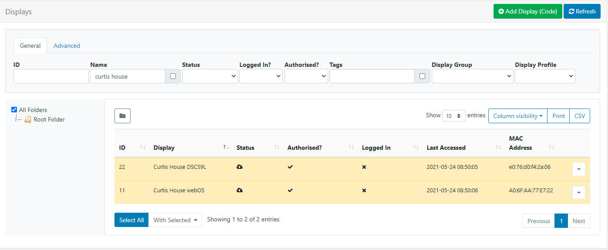
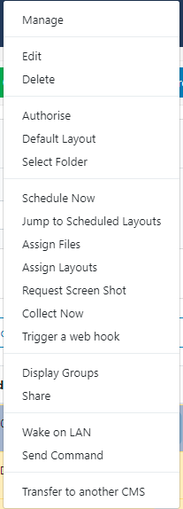
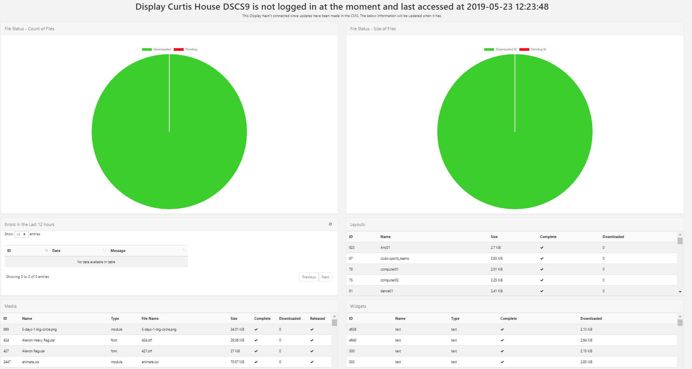
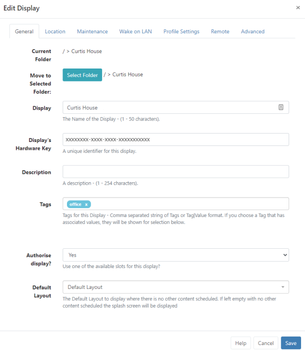
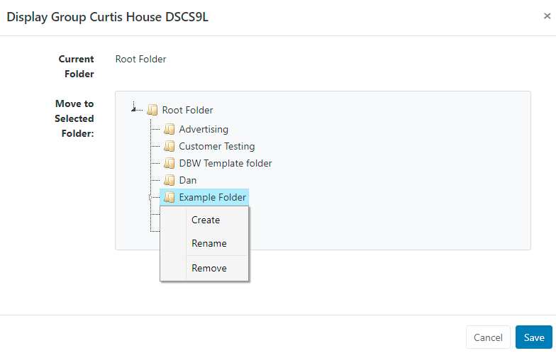
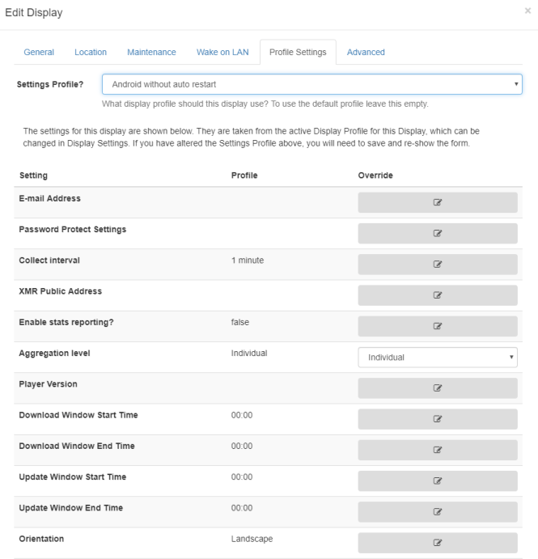
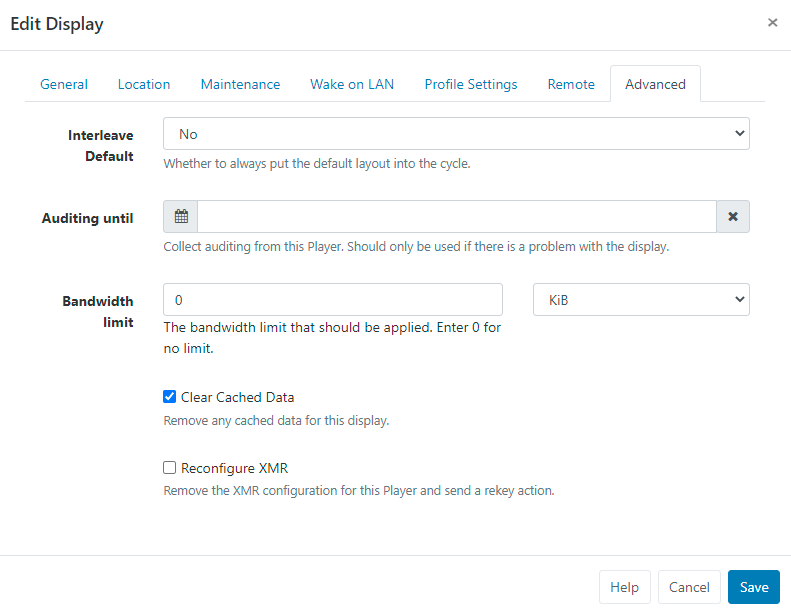
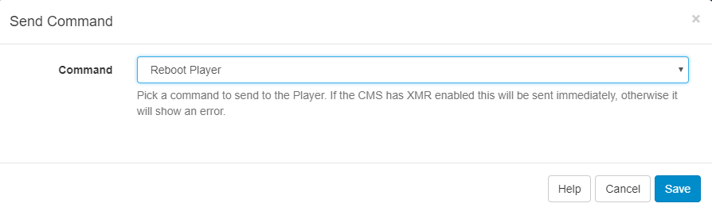

# Displays

The primary purpose of Sigma DS is to show content on screens with the entire application suite existing for that one purpose. Sigma DS provides a concept called Displays to manage when and how content is shown on a screen.

When no other content is Scheduled, of if there is an issue that prevents the scheduled Event from showing, we highly recommend that a Default Layout is set so that something is always shown on Displays! You can create your own Default Layout to replace the existing one, but keep in mind that designs should be kept simple with no complex media or web content. Edit a Display to select or use the Row Menu and click on Default Layout to select your designed Layout from the dropdown menu.

Please note: If no Default Layout is set or there is an issue with the Default Layout that has been set, the splash screen will be shown on Displays!

Displays are uniquely identified by a hardware key which is generated when the Signage Player software is installed. This hardware key is used to create a Display record in the CMS and is unique to that one Display record.

## Display Administration

Displays are administered in the CMS from clicking on Displays under the Administration section of the main menu. The Displays Grid will open for you to add new and manage exiting Displays.



The Folder tree will open by default:

```
Click on a Folder/sub-folder to search the
contents and return results based on any filters applied to the grid.
```

or

```
 Tick All Folders to include searching in the Root Folder
 and return results based on any filters applied to the grid.
```

Click the Folders icon to toggle on/off from view. When Folders are hidden from view, the file path for the selected folder will be shown!

Logged in Users will only view the status of Displays that they have been given access to!

ID - Used for internal identification of the Display only.

Display - Name given to the Display for easy identification purposes within the CMS (this is not shown on the Display itself).

Status - Tick = Player is up to date (this may also show as green in colour). Cloud Icon = Player has not logged in with content waiting to be downloaded (this may also show as amber in colour, as above) Cross = Player is currently downloading new content and has yet to complete the download (this may also show as red in colour)

Authorised - Tick or cross to indicate whether the Display has been granted a licence with the CMS. This prevents unauthorised Displays being added to the CMS.

Include the Commercial License column using the Column Visibility button to easily identify the Commercial Licence status of your Displays!

Logged In - Tick or cross to show if the Display has logged in recently.

Last Accessed - Date and time stamp of when the Display was last accessed.

MAC Address - Media Access Control Address of the Display (if the Player software is capable of sending it).

Use the Column visibility button to select from the available options to show the information you would like to display for your administration purposes. Deselect to remove a column from the Displays grid!

## Row Menu

Each Display has a Row Menu containing a number of actions that can be performed:



Selected actions allow for Forms to be automatically submitted by clicking on the action from the Row Menu, such as Authorise and Check Licence. Actions that have an auto submit capability will display an option to enable. Take a look at Grids for further information!

## Manage

Each Display has its own Dashboard which shows the Displays current status, bandwidth usage, file status and errors.



This Dashboard is useful as a first step to look at when troubleshooting issues with a Display!

## Edit

Clicking on Edit opens the Edit Display form which contains tabs with configuration options.



The unique hardware key that is generated during installation is shown on the General tab for the selected Display!

## Folders

Displays can be optionally saved to Folders using the Edit form or from the Select Folder option on the Row Menu.

```
Displays that are saved in Folders will inherit the View, Edit, Delete
Share options that been applied to the destination Folder for the User/User Group!
```

Click on the Select Folder button and expand to select a Folder to save in.


Users can also right click a Folder to access further options.

Available options are based on enabled Feature and Sharing options for a User/User Group!

Further information for Administrators regarding Folder access and set-up can be found here

Assign multiple Displays to a Folder using the With Selected option at the bottom of the grid!

The selected folder file path will be shown next to the Folder field on the form

## Tags

Displays can be tagged for organisation and to make it easier to find a large number of Displays all grouped by Tags. When entering text into the Tag field on the form, an auto complete helper will show possible matches to make it easier for Users to select from.

```
Predefined Values will be shown by using the Tag value drop down,
if the Value is already known it can be typed directly into the field
using the following format: Colour|Red
```

If a Value has been set as 'Required' by an Administrator, then the Value must be entered in order to save the form!

```
Users can add an associated Value to a Tag that does not already
have a predefined value by using the Tag value field. If a Tag
value is not needed, this field can be left blank.
```

Tags can also be assigned to multiple Displays using the With Selected option at the bottom of the grid!

For further information on what Tag and Tag Values to use, please speak with your Administrator.

Tag management information for Administrators can be found here

Override Display Profile Settings for individual Displays Use the Profile Settings tab to see the settings applied from the selected Display Settings Profile.



Click the edit icon to change selected settings to override the Profile.

## Set Bandwidth Limits per Display

Use the Advanced tab to apply a limit to determine the amount of bandwidth that a Display can consume.



Set bandwidth limits for multiple Displays using the With Selected option at the bottom of the grid!

## Delete

Deleting a Display will remove it from the CMS entirely - this operation cannot be reversed. A deleted Display can be reconnected to the CMS by repeating the “Register” procedure which will create a new unique Display record.

Deauthorise a Display instead of deleting so that it can be re-authorised at a later date if needed. Use the row menu for the Display and click on Authorise to toggle to Deauthorise. This can also be actioned from the Edit Display form by selecting No for Authorise display.

## Send Command

The Send Command functionality is executed via XMR to Players by selecting a predefined command. This is useful for sending Players 'Reboot' commands for example.



Administrators create predefined commands for use, therefore if you require additional commands, please contact your Administrator.

Administrator information on the Command Functionality can be found here

This type of Command can also be executed by scheduling a Command Event
