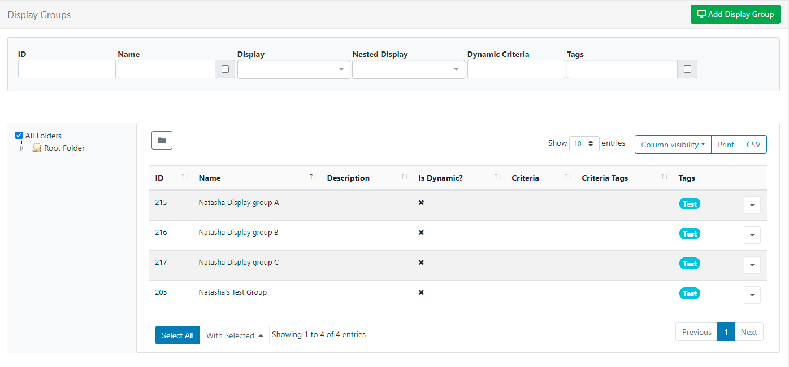
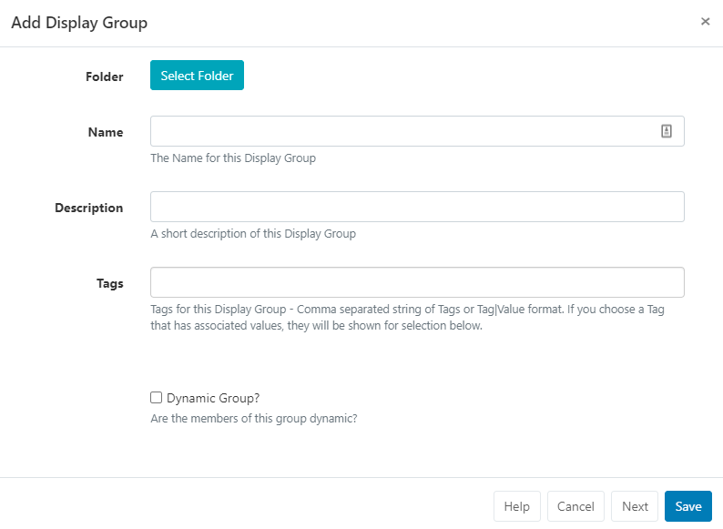
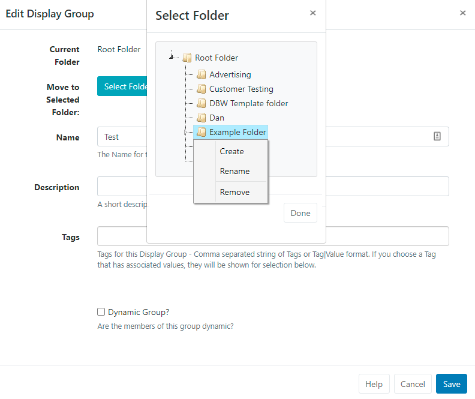

# Groups

For ease of Scheduling and Media Assignment create Display Groups and assign Displays to one or multiple Display Groups.

Display Groups are administered in the CMS by clicking on Display Settings under the Displays section from the main menu. The Display Group grid will open to Add new and manage existing Display Groups.



The Folder tree will open by default:

- Click on a Folder/sub-folder to search the contents and return results based on any filters applied to the grid.
  or

- Tick All Folders to include searching in the Root Folder and return results based on any filters applied to the grid.

Click the Folders icon to toggle on/off from view. When Folders are hidden from view, the file path for the selected folder will be shown!

Logged in Users will only view the status of Displays that they have been given access to!

## Add/Edit

Click on the Add Display Group button to create a new Display Group or use the Row Menu to Edit an existing Display Group.



## Folders

Display Groups can be optionally saved to Folders.

```
Display Groups that are saved in Folders will inherit the View,
Edit, Delete Share options that been applied to the destination
Folder for the User/User Group!
```

- Click on the Select Folder button and expand to select the Folder to save in/move to.
  

- Users can also right click a folder to create a new folder to save in and access further options.

Available options are based on enabled Feature and Sharing options for a User/User Group!

Further information for Administrators regarding Folder access and set-up can be found here

```
Assign multiple Display Groups to a Folder using the With
 Selected option at the bottom of the grid!
```

## Tags

Display Groups can be optionally tagged. When entering text into the Tag field, an auto complete helper will show possible matches to make it easier for Users to select Tags already added in the system.

If Tags require a predefined value, these will be shown in the Tag value drop down menu, or of already known can be directly typed into the field.

If a Value has been set as 'Required' by an Administrator, then the Value must be entered in order to save the form!

```
Users can add an associated Value to a Tag that does not already
 have a predefined value by using the Tag value field.
 If a Tag value is not needed, this field can be left blank.
```

Tags can also be assigned to multiple Display Groups using the With Selected option at the bottom of the Display grid!

For further information on what Tag and Tag Values to use, please speak with your Administrator.
