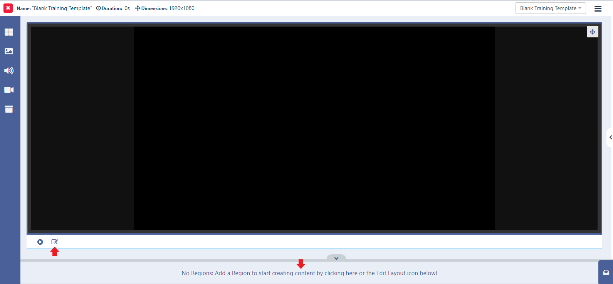
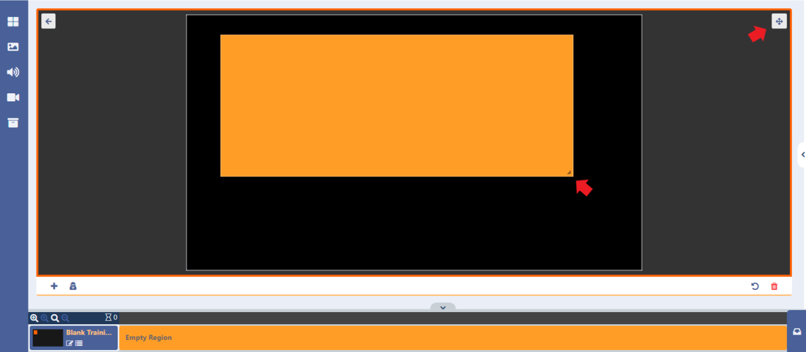
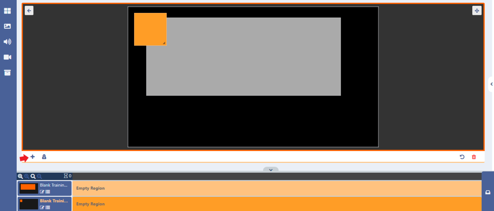
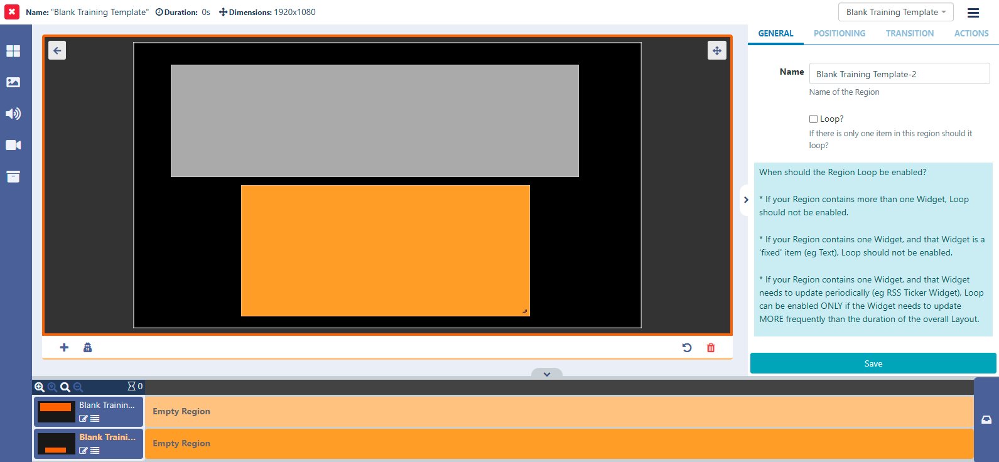
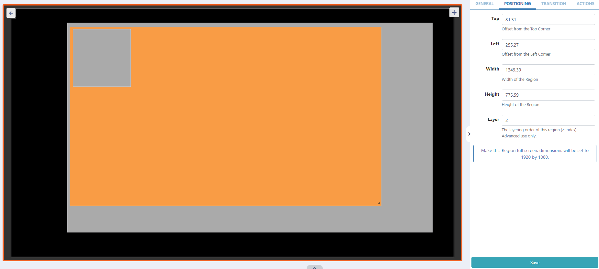
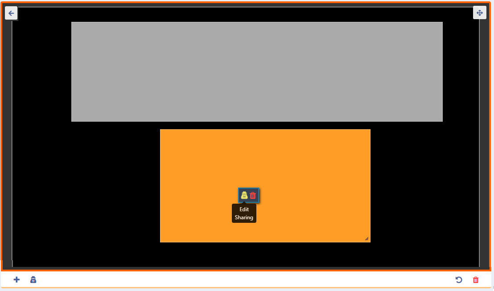

# Regions

Regions define areas on a Layout which hold Media to form sets of timed content which are added and edited by using the edit layout icon located below the viewer:


```
If you have chosen a blank template, you can also click the ‘No Regions’ banner to open the editor.
```



- Click on a Region to select (highlighted orange once selected) and resize by using the handle located in the right bottom corner.
- Move a selected Region around the canvas using drag and drop.
  ```
  You can toggle to a full sized screen using the icon located in the top right of the editor.
  ```

```

When you are in ‘editing’ mode you will notice that the window is framed orange!

```

- Add further Regions by clicking on the + button located in the bottom left:



- Clicking anywhere on the canvas will save changes made to a Region.
  Further options are available in the properties panel:

- Highlight a Region to view the options



- The General tab allows you to optionally create a Name for a Region for easier identification in the CMS, and to enable the Loop option if it is required.

```
When to enable Loop?

It may be desirable to have a Region with just 1 media item reload when that item has finished. With the Loop ticked the media item will reload each time it expires and show refreshed content until other Regions have fully played out. Loop is only effective for a Region with only 1 media item and should only be used for certain Media types where the content changes (Ticker RSS, Calendar etc).

Consider the following rules when thinking about using the Region Loop option for the best results:

- If your Region contains more than one Widget, Loop should not be enabled.
- If your Region contains one Widget, and that Widget is a ‘fixed’ item (eg Text), Loop should not be enabled.
- If your Region contains one Widget, and that Widget needs to update periodically (eg RSS Ticker Widget), Loop can be enabled ONLY if the Widget needs to update MORE frequently than the duration of the overall Layout.
```

- Use the Positioning tab for more precise sizing and positioning of Regions, as well as setting a Layering Order for playback.

## Rules for Layering Regions:

```
Please note: You cannot overlay anything on a Region that has Widgets / Media that use the Edge browser. This would include HLS and Embedded Youtube. For content other than a video you can use the CEF browser instead.
```

If required, overlapping Regions can be ordered for playback using z-index settings.

Enter a number in the Layer field to determine the order that Region should be shown within the overall stack.

The Layer order is determined by the number entered here, with 1 considered the lowest Layer. The higher the number the higher the Layer.

```
On some devices, it is impossible to overlay anything on a Region showing a Video or VideoIn Widget. Whether it is possible will depend on the device and whether hardware accelerated playback is being used. In general, it is possible on Android (when not using the SurfaceView option in the Display Settings Profile, Linux, Tizen and webOS Players, but if you have a requirement for this, be sure to test your intended device carefully to ensure this works in your use case.
```

At the bottom of this tab, click on the Make this Region full screen text to resize as shown by the dimensions displayed here.

- Select the Transitions tab to apply an Exit Transition for when the Region finishes playing.
  Exit transitions happen when the last media item in a Region is shown and occurs only when all other media items have expired in the other Regions.

- Ensure any edits made are saved using the Save button before returning to the Layout View.
  Actions can be attached to Regions to effect changes on the Layout. Full details are available on the Interactive Actions page.

## Share options for a Region

Control which Users/ User Groups can have View/ Edit /Delete access for a Region.

```
Please note: The owner of the Layout has full control over sharing.
```

- Assign and Edit Share options by right clicking on the target Region to open the form:
  

```
Alternatively Share options can be accessed from the context menu at the bottom of the viewer!
```

Remove Regions by highlighting the Region to delete in the viewer or timeline and click the bin icon. Please note: This action cannot be undone!
