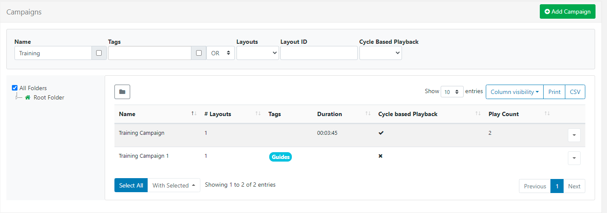
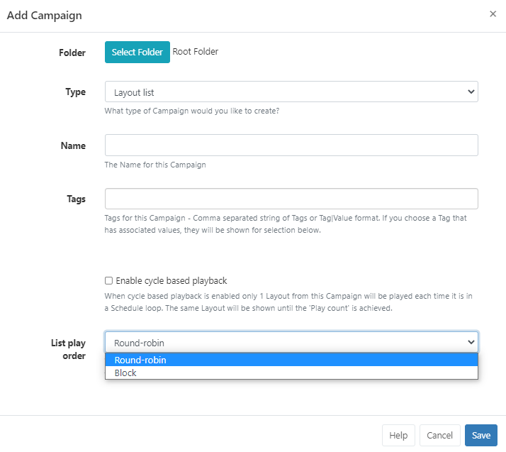
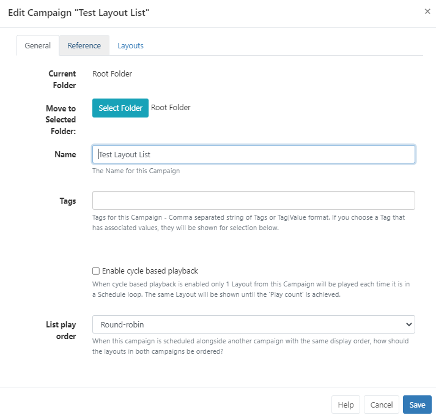
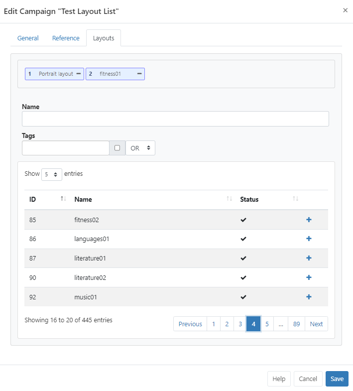
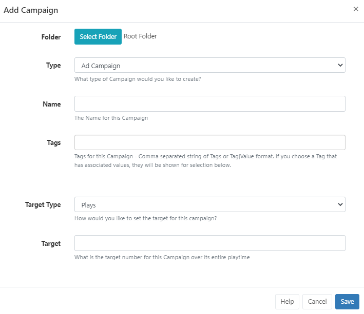
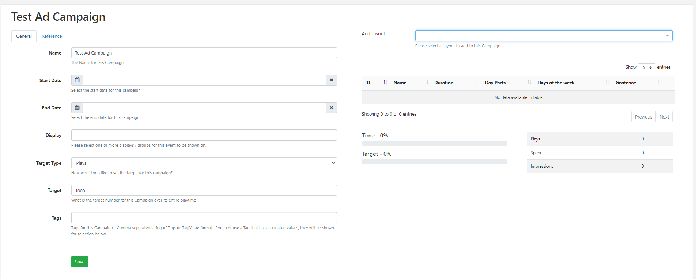
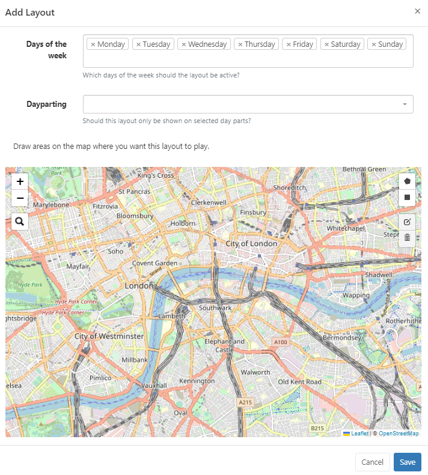
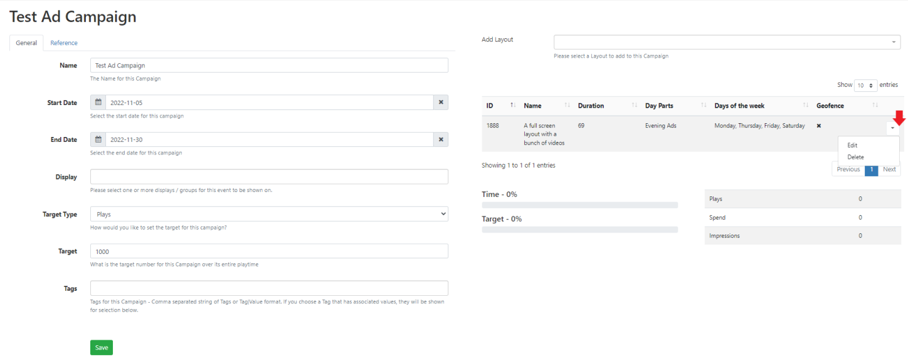

# Campaigns

available Campaign types:

- Layout List
- Ad Campaign (Feature enabled for Users/User Groups)
  Campaigns are administered from the Design section of the CMS Menu:
  

A Campaign type is selected when adding a new Campaign to the grid.

# Layout List

Layouts can be grouped together into an ordered list. A Campaign can then be Scheduled to play the grouped Layouts in a set sequence.

## Create a Layout List Campaign

Click on the Add Campaign button at the top of the Campaigns grid.

Select Layout List from the drop down:


Complete the required form fields:

- Campaigns can be optionally saved to Folders.

```
Campaigns that are saved in Folders will inherit the View, Edit, Delete Share options that have been applied to the destination Folder for User/User Group access.
If users should also have access to the Layouts/Layout content, ensure that this is also saved to the same Folder!

```

- Provide a Name for easy identification purposes within the CMS.

- Include optional Tags to organise and make it easier to search for.

```
Tags and Folders can also be assigned to multiple Campaigns using the With Selected option at the bottom of the Campaign grid!
```

## Cycle Based Playback

- Optionally enable cycle based playback for the Campaign.
- If enabled, provide a Play Count to determine how many ‘plays’ a Layout should have before moving onto the next Layout in the Campaign.
  When you schedule a Campaign with cycle playback enabled, each time the scheduled event appears only 1 Layout will be shown for the set count from the Campaign.

## List Play Order

Use the List play order drop down to select how you would like the Layouts in the Campaign to play when scheduled alongside another Campaign with the same Display Order in Scheduled Events

- Round Robin - Layouts from each Campaign with the same Display Order will play interleaved.
  Block - Layouts will play in their entirety from the Campaign before moving onto the next.
  Click to Save.

- On saving the form will re-open with additional tabs:
  

# Reference

Optionally use this tab to provide reference information for the selected Campaign. Once added, this information can be viewed in the Campaign grid and via the API.

# Layouts

Use the Layouts tab to assign Layouts to this Campaign:



- Assign Layouts using the plus icon. Selected Layouts will be added to the ‘staging area’ at the top of the form.

- Remove by clicking the minus icon next to a Layout from the staging area.

- Re-order selected Layouts using drag and drop to ensure that Layouts play in your chosen sequence.

Click Save to keep changes.

```
Use the Copy button located on the row menu to easily make a copy of an existing Campaign as well as enabling Share options for selected Users/User Groups!
Layouts can be directly assigned to Campaigns from the Layouts grid. Use the row menu for the Layout to add and click Assign to Campaign. Layouts will be assigned to the end of the selected Campaign by default!

```

## Ad Campaigns

Create Advertising Campaigns to be shown on selected Displays. Sigma-DS will work out how many plays are needed to satisfy entered criteria and handle the scheduling automatically.

```
This Feature should be enabled for each User/User Group who requires access!
```

## Create an Ad Campaign

Click on the Add Campaign button at the top of the Campaigns grid.

Select Ad Campaign from the drop down:


Complete the required form fields:

- Campaigns can be optionally saved to Folders.

```
Campaigns that are saved in Folders will inherit the View, Edit, Delete Share options that have been applied to the destination Folder for User/User Group access.
If users should also have access to the Layouts/Layout content, ensure that this is also saved to the same Folder!
```

- Provide a Name for easy identification purposes within the CMS.

- Include optional Tags to organise and make it easier to search for.

```
Tags and Folders can also be assigned to multiple Campaigns using the With Selected option at the bottom of the Campaign grid!
```

- Use the drop down to set the Target Type for this Ad Campaign, Plays, Budget or Impressions.

- Include the total Target number for this Ad Campaign in relation to its selected Target Type.

- Click to Save.

The new Ad Campaign record will be added to the grid.

- Use the row menu and select Edit to provide the required criteria in order that Sigma-DS can work out the play frequency:
  
- Provide Start and End Dates and Times for the Ad Campaign. (This is required information and cannot be left blank)
- Select from available Displays and Display Groups to play this Ad Campaign on. (This is required information and cannot be left blank)

```
Ensure that Displays have had Display Details correctly entered for the selected Displays which play this Ad Campaign, ensuring that Cost per play and Impressions per play fields have been completed!
```

Click to Save.

```
Proof of Play needs to be set to ON for all Displays/Display Groups selected here, to ensure accurate reporting and plays!
```

Assign a Layout using the Add Layout drop down menu.
Once a Layout is selected further scheduling options are available:


- Select which Days of the Week this Layout should be active in this Ad Campaign.

- Choose from existing Dayparts if this Layout is only to be shown at selected predefined times.

```
Ad Campaigns can include multiple instances of the same Layout with different Dayparts assigned if required.
For example, If you needed to show the same Layout for a defined ‘Morning’ daypart as well as a defined ‘Evening’ daypart add the Layout twice and define the required dayparts individually for each!
```

- Draw areas on the map to provide geo fenced based plays for any mobile displays, with content to be shown on entering a defined area.

```
You can have multiple areas defined on the same map!
```

Click to Save.

The Layout will be added to the Campaign which can be edited/deleted if required using the row menu:


Continue to build your Ad Campaign by selecting Layouts and defining scheduling options.

```
Proof of Play needs to be set to ON for all Layouts added to the Ad Campaign to ensure accurate reporting and plays!

```

This will schedule automatically to fulfil the required play criteria to meet entered Targets.

Ad Campaigns can be viewed on the Schedule as locked entries which cannot be edited from the scheduler itself.

The Agenda View can be used to see a more detailed play view of the Ad Campaign and preview included Layouts.

The Ad Campaign progress will be shown in the Campaigns grid and on opening the Ad Campaign, providing that Proof of Play has been set to ON for all Displays and Layouts selected for the Campaign. As well as Cost per play and Impressions per play fields are completed for all selected Displays.

Please note: If the above information is omitted the reporting cannot update to reflect Plays, Spend, Impressions and Target which will all show a 0 value. The Ad Campaign itself will also try and catch up to increase the Target which will result in Layouts being played more and more frequently until its the only content shown in order to fulfil the target.


Reference
Optionally use this tab to provide reference information for the selected Ad Campaign. Once added, this information can be viewed in the Campaign grid and via the API.
