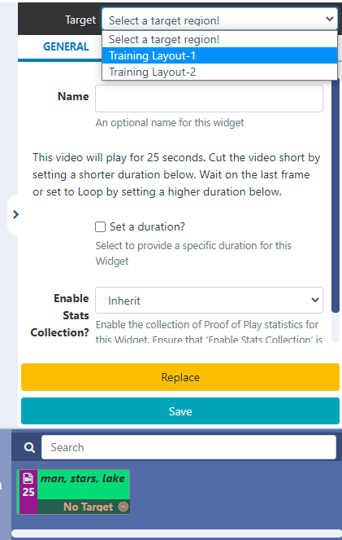
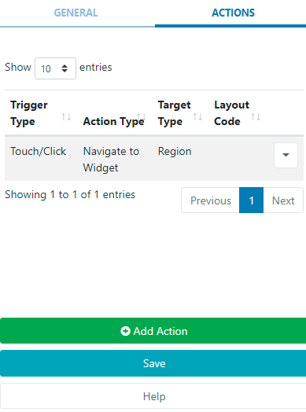

# Interactive Actions

Actions can be attached to an entire Layout a particular Region or specific Widget and can be used to effect changes to the Layout. These can be triggered by Touch or Click or programmatically by webhook.

```
Scenario: A Product display has a product that the customer can pick up. An ‘internet of things’ device, such as a light sensor could be used to trigger a webhook to Sigma-DS which loads that particular products information into a Region to be shown.
```

More information on webhooks can be found in our Developer documentation here

## Adding an Action

Interactive Actions are accessed from the Layout Designer and created and managed from the Actions tab in the properties panel for a Layout, Region or Widget.

- Using the Actions tab, click on the Add Action button to create a new action.

- Use the drop down to select how this Action should be triggered:

Trigger by touching or clicking anywhere on a Layout, a particular Region or a particular Widget
Include a Trigger Code, which must be present in the URL ``trigger=` parameter.

```
When triggering by touch using Android, ensure that Touch capabilities are enabled for the device from Display Settings using the Advanced tab!
```

- Select the Action to determine what will happen when triggered:
  Next / Previous item in the Schedule - this option is available for selection when adding an Action to an entire Layout.

Next / Previous Widget in the Timeline - this option is available for selection when adding an Action to a Region or Widget.

Navigate to Layout - on selecting this option a further field will be presented to select the Layout Code to identify the Layout to be used from the drop down menu.

```
Layouts need to have a Code Identifier assigned in order to be included in this list for selection. Edit Layouts to include codes or assign when adding new!
```

- Navigate to Widget - to use this option, Widgets first need to be added to the Interactive Drawer from the Layout Designer and a Target Region has to be set:
  

Once saved, added Widgets will show for selection using the Navigate to Widget drop down menu.

Select the Target:

- Use the Screen option if your Widget is a Shell Command which will run the command without affecting any Regions.
- Select the Region option for ALL OTHER Widgets.

Once all relevant fields have been completed, click the Save button.

