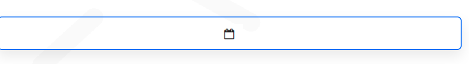
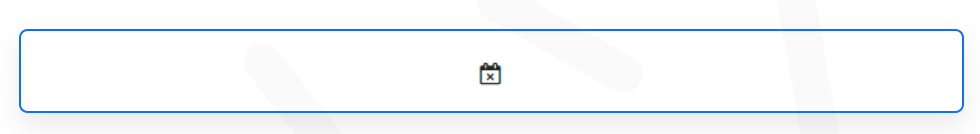
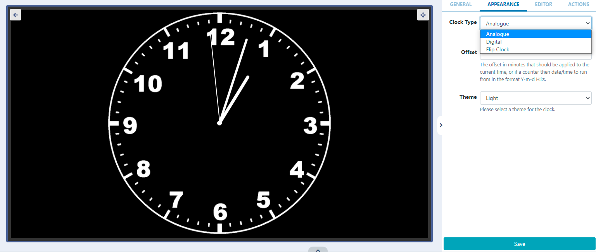

# Overview

The Layout Designer is the heart of content creation in Sigma-DS. Each time a new Layout is added, or an existing one needs a design change, the Layout Designer is used.

On adding a new Layout, or clicking Design from the row menu of a Layout, the Layout Designer will open:


## Status Bar

The left hand icon shows you the current ‘play’ status of the selected Layout:

- This Layout has not been built yet.
  

- This Layout is valid and can be scheduled once Published.
  

- This Layout is invalid and will not be Published for scheduling.
  

- This Layout contains media that can only be assessed Player side, and can be scheduled once Published.
  

```
The last icon is a normal Layout status to have if your Layout contains online content, such as a webpage etc. The CMS cannot say that the Player will display the content as it is not sent directly from the CMS (as with file based media, images, videos etc,) and is instead cached (stored) Player side. The Player will need to have a reliable internet connection to successfully display such content.
Hover over the icon to see further information regarding the status you are seeing!
```

Next to the icon the total Duration of the selected Layout is displayed in seconds which updates each time a Media item is added or an existing Duration is edited.

The overall Layout duration is always based on the longest running Region on the Layout!

Interactive Actions that have been added to the Layout will be shown in the status bar.


The Layout selector provides easy navigation between all Layouts the logged in User has permission to edit without having to leave the Layout Designer page. Enter search criteria and use the dropdown menu to change the Layout you are currently viewing/editing.

```
Use the checkbox to only access your own Layouts!
```

The Menu located to the right of the Status bar provides a list of options for Layouts.

Layouts in a Draft status have the following menu options:


Once you are happy with your designs, set your Layout to Publish ready to be Scheduled.
Layouts can be set to be Published straight away with updates automatically pushed to Layouts that are in the schedule. A Publish Date can also be selected to Publish a Layout at a specified date and time.

```
You can also use the Row Menu for a selected draft Layout to set to Publish immediately or on a set date..
```

- Clicking on Discard draft will delete the draft and leave the Published version untouched.

- Unlock Layout will show when another User is attempting to edit the same Layout.

If a User attempts to edit a Layout that is already being edited by a User, the Layout will lock to prevent editing. The Layout will remain locked for a specified amount of time (as shown in the lock message) or until the Layout is unlocked from this menu.

```
On selecting the Unlock Layout button, the User will be redirected to the Layout Grid.
```

Layouts that have been Published have the following menu options:


- Checkout to enable editing by putting the published Layout into a draft status.

- Delete layout to completely remove.

- Schedule published Layouts onto one or more Displays without having to leave the Layout Designer.

- Use your design as a Template for creating additional Layouts to save time and to maintain a corporate image/standard.

## Viewer

The viewer will update as the Layout is designed so that users can clearly see what has been added and make necessary edits:

Edit or add Regions to your Layout using the Edit Layout Icon located under the viewer to open the editor:


```
A Layout must contain at least one Region and each Region must contain at least one media item for it to be valid and play when scheduled.
```

Exit the editor and return to the Layout view using the back arrow in the top left corner of the viewer.

## Context Menu

All Widgets/ Library Media and Regions have a Context Menu with a set of options that can be applied. This menu is located under the viewer for a selected Widget or Region or by right clicking a selected Widget or Region:


- Control Sharing options to View, Edit and Delete for Users/User Groups
- Select an Audio file from the Library to be attached to a Widget.

```
Users can enter a Volume as well as a Loop parameter to determine whether the audio will loop for the duration of the attached Widget or just play through once. Audio will be stopped once it’s parent Widget finishes playing.
```

Once an audio file has been attached to a Widget, a speaker icon will show in the Timeline which can be clicked to re-open to edit.

```
If audio is assigned to a Widget which is the only Widget in the Region, the audio will stop once the Widget duration has expired but the Widget will remain visible on screen until the rest of the Layout has expired!
```

Enter Start and End times for Widgets


```
NOTE: Start dates for Library Media can only be assigned once added to a Widget on a Layout or Playlist and not at Upload!
```

- Start date has been set for a future date/time.
  

- Expiry date has been set.
  

- Widget has been marked to be deleted on reaching the expiry date.
  

- The Widget has expired but remains on the Layout
  

```
Once the End date has passed the Widget will be removed from the Region. Expired Widgets that have not been set to Delete on Expiry will remain visible in the Layout Designer so that Start and End times can be re-adjusted if needed.
```

Click on an icon to re-open to edit.

```
It is important to note that the Layout will be marked invalid and not sent to Players if a Region is empty due to Widget expiry. It should also be noted that if at the time of download there was a valid Layout but the Player has since gone offline, the Layout will show with an empty Region.
```


- Select a Fade/Fly In transition for when the Widget starts playing.

- Select a Fade/Fly Out transition to move onto the next Widget in the Timeline.

If there are no more Widgets to follow or the Layout is in the process of being removed then the Exit Transition will apply as configured in Region Options.

Default Transition Type’s and Duration can be entered by an Administrator on the Settings page using the Defaults tab, which can then be applied to all Widgets.

Applied defaults can be overridden for Layouts by unticking the box in the properties panel.

```
When Transitions are applied to a Widget by default, the properties panel will be blank. Only manually entered Transitions will show on forms!
```

Play a full Preview of your Layout by clicking on the Play button located at the bottom of the viewer:


## Toolbar

Add content to your Layout using an array of Widgets and Library Media accessed from the Toolbar located on the left hand side:


## Properties Panel

Edit all the elements of your Layout, Regions and assigned Widgets using the available options in the properties panel located on the right.

Use the tabs to configure media items using the available options for the content:


```
Layouts, Regions and Widgets can have Actions attached to effect changes to the Layout, triggered by Touch, click or by webhook. Interactive Actions are created and managed from the Actions tab in the properties panel.
```

Use the properties panel whilst in the main Layout view, to access further configurations to apply to the Layout such as adding a background colour or selecting/uploading an image to use as the background:


## Adding a Background Image

Add an Image which has already been added to your Library. Select an Image from the Image Library Search function from the Toolbar and click or drag to the Background Image area of the properties panel:


Ensure to Save clicking the button at the bottom of the properties panel:


```
New Images can also be added by using the Upload button from here!
```

## Layout Timeline

The Layout Timeline displays the duration of individual Widgets and gives you an overview of how your configured media will play on the Layout. Icons will show to identify any options that have been applied which can be clicked to view in more detail and to edit.


## Interactive Drawer

Located to the right of the Timeline, the Interactive Drawer is used to add Widgets to be used when configuring Interactive Actions.


- Toggle the drawer to open and add Widgets or Library files by clicking to add or drag and drop.

- Once added, set a Target Region and configure using the available options in the properties panel.

``
Use the Search field in the drawer to find Widgets already added to the drawer!

```
## Delete/Revert Buttons
Use as you create your designs to undo any changes or to completely remove from the Layout.


```

Hover over the buttons for further information as to what selecting a button will do!

```

```
