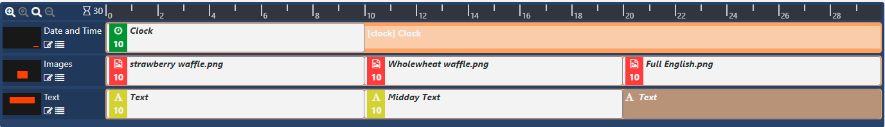
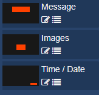
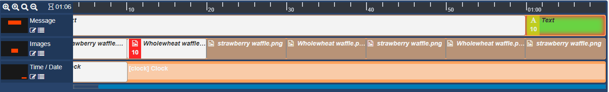
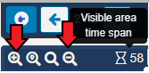
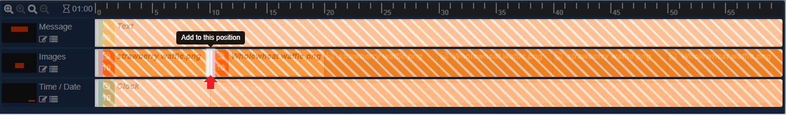

# Layout Timeline

Each Region on a Layout has its own Playlist of content, which is shown in a specified order by a Player.

A Playlist can consist of a single item (such as a company logo), or multiple items (such as an image slideshow).

A Region’s Playlist is viewed/edited in the Timeline in the Layout Designer:


The timeline clearly shows how each Regions assigned Widgets will play. The greyed out entries indicate what will play when that items own duration is exceeded.

The window to the left of the Region gives a preview of the Region positioning on the Layout.


Clicking on a Region here will open the editor and show the available options in the properties panel.

```
You can also use the edit icon to open the editor!
```

Click the back arrow in the top left of the viewer to exit the editor and return to the Layout view.

## Assigning Content

Use the toolbar on the Layout Designer to add Widgets or use the Library Search to add content that has already been uploaded to the Library.

```
Widgets that are available can be enabled/disabled by an Administrator in the Modules section of the CMS.
```

Once Media has been added, the timeline will automatically scroll to the newly added content (highlighted as green) for easy configuration.


```
Drag Widgets in the Timeline to reorder the sequence they should play for that Region!
```

Use the timeline buttons to zoom in and out to decrease/increase the visible time span and use the blue scroll bar to see all assigned content in your Timeline.


```
Easily snap back to the Widget you are currently working on when scrolling through the Timeline by using the Scroll to Selected Widget button.
```

Content can be added to a specific point on the Timeline.


Drag or click to add media to a position marker shown on the Timeline.

Media can also be added to a Region in a Playlist view by clicking on the menu icon to the right of a a Region.

A Playlist view will open to add content in the same way.

## Deleting from Regions

To delete, click on the Widget assigned in the Layout Timeline and click on the red bin icon in the bottom right hand corner of the screen.

```
Right-clicking on a Widget in the Timeline will open a context menu of further options.
Use to attach audio, set expiry dates and transitions as well as set Sharing access for Users / User Groups!

Use the arrows to move Widgets along the Timeline to reorder the sequence.
```
