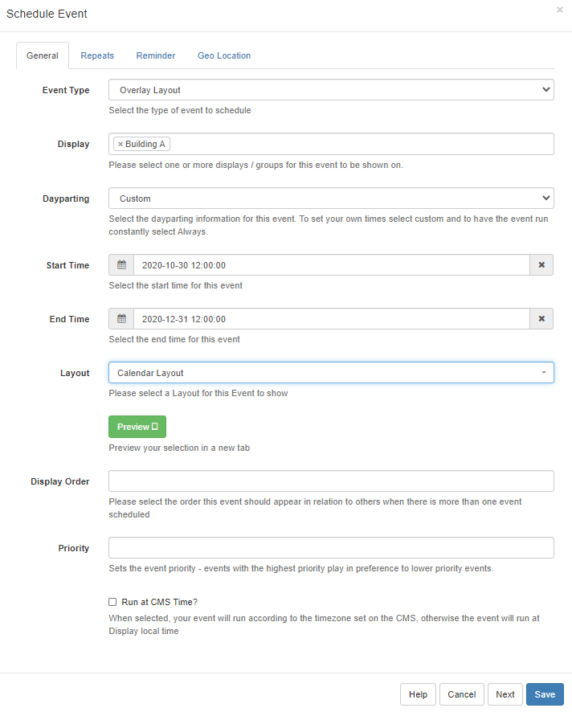

# Overlay Layouts

Schedule as an Overlay Layout to tell Sigma-DS to display the Layout on top of normally Scheduled Layouts. Overlays remain on top while your normal scheduled content changes underneath, particularly useful for logos, important information or emergency notices.

## Create an Overlay Layout

Overlay Layouts are created in exactly the same way as all other Layouts. Add Regions to fit around your existing content so that your Overlay Layout can “sit on top” of other Layouts that are Scheduled at the same time as the Overlay. Your Overlay Layout will display its all important content whilst the Layouts “underneath” playout in rotation.

```
this will not render the background on Players when a Layout is scheduled as an Overlay Layout.
Please note: Layouts that contain Widgets / Media that use the Edge browser cannot be used with an Overlay Layout as content cannot sit on top of other content under these circumstances. This would include HLS and Embedded Youtube. If your content is not a video then the CEF browser can be used instead.

```

Overlay Layouts can also be used for Campaigns.

## Scheduling

Overlay Layouts are selected as an Event type when Scheduling an Event and will behave differently to standard Layouts when Scheduled as an Overlay.


# - Refreshing Content

When an Overlay Layout is scheduled it will render the Media content once and will not show refreshed content.

```
A workaround to this would be to add a second Media Item to the Overlay Layout so that it loads item 2 and then reloads item 1 (with now refreshed content). This is particularly useful when creating an Overlay Layout which includes the Calendar or Ticker Widgets for example.
```

# - Scheduling multiple Overlays

Overlay Layouts do not appear one after the other in Scheduling but instead will stack.

```
Scenario: 2 Media items are required to ‘Overlay’ other Scheduled Events in the same area of the screen. Rather than creating 2 Overlay Layouts with the assigned Media, only 1 Overlay Layout should be created which would then contain the 2 Media items within the Region.
```
