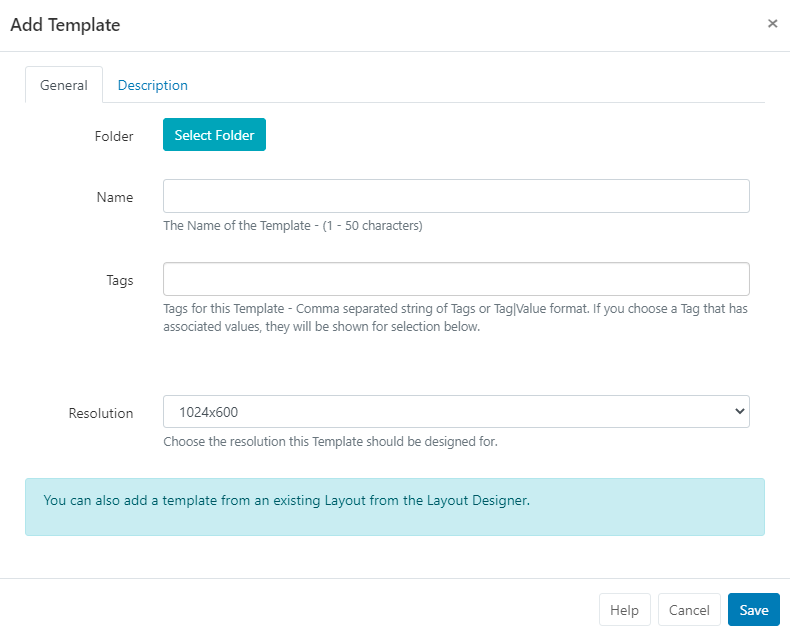
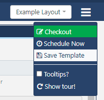
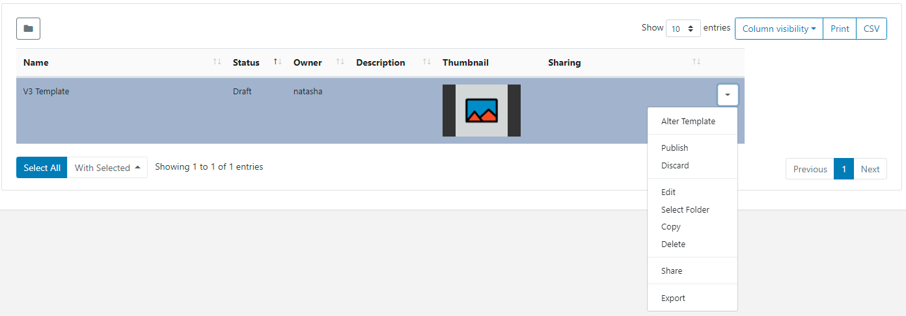

# Templates

Templates are saved copies of designed Layouts which can then be used when creating new Layouts. Using a template can speed up the design process and is a good way to ensure that a corporate image/standard is maintained.

## Creating a Template

Templates can be created two ways:

1. Adding directly from the Templates page

2. Saving an existing Layout as a Template

## 1. Add Layout from Template Page

- Click on Templates under the Design section of the main menu
- Select the Add Template button and complete the appropriate form fields.
  
- Templates an be optionally saved to Folders for easier searches, organisation and to easily set Share options for Users/User Groups.

```
Templates that are saved in Folders will inherit the View, Edit, Delete Share options that have been applied to the destination Folder for that User/User Group.
If users should also have access to the content of the Template, ensure that this is also saved to the same Folder!

```

- Provide a Name for easy identification purposes within the CMS.

- Include optional Tags to organise and make it easier to search for.

- Select the Resolution to be used for this Template/Layout.

Templates/Layouts are designed for an intended display Resolution and will function best when shown on a Player with a matching resolution. If they are shown on a display that has a different resolution it will dynamically resize which may result in unused screen space.

```
Sending a Player a Layout that has been designed with a 4:3 resolution which is connected to a 16:9 TV screen would result in two empty bars either side of your content.
```

- Provide a Name for easy identification purposes within the CMS.

- On saving the form, the Layout Designer will automatically open.

## 2. Saving a Layout as a Template

A Published Layout can be saved as a Template from the Layout Designer by using the status menu and selecting Save Template:


```
Layouts can also be saved as Templates by using the Row Menu for a Layout in the Layouts Grid and selecting Save Template!
```


Complete all relevant form fields to save the selected Layout as a Template:

- Use Select Folder to move from the shown Current Folder Location.
- Give the Template an identifiable Name so that Users can easily select from the Template drop down when adding Layouts.
- Assign Tags if required.
- Provide an optional description/explanation/instructions to other users of this Template.
- Use the tick box to include all Widgets that have been added to the Layout to be included in the Template.
- Save
  Once saved, Templates can be managed from the Templates grid.

Each Template has additional actions/shortcuts that can be accessed from the row menu.


Alter Template - Use to open the Layout Designer to make design changes to the Template.

Checkout - If the Template has been Published, Checkout to edit.

Publish - Publishing a Template will add it to the list of selections when adding a new Layout from v3.1.

Discard - Revert back to the previous Published version and discard all changes made whilst in a draft status from v3.1

Edit - Make changes to the Template record such as, Folder location, Name and Tags etc.

Select Folder - add or make edits to a selected folder path.

Copy - Create copies of Templates and choose to include all contained Media items, to use as a base for creating new Templates or to simply make modifications.

Delete - Remove a Template and all its associated media. Layout specific media such as Text/RSS will be deleted. Please note: This action is irreversible!

Share - Enable View, Edit and Delete access for selected Users/User Groups.

Export - Export the Template including all associated Widgets/Media/DataSet structures to a ZIP file, so it can be easily shared.

```
When exporting a Template, all assigned Layout, Playlist and Media Tags will be exported. Select the Import Tags option to add these Tags on Layout Import.
Use the With Selected option at the bottom of the Templates Grid to Edit Tags, move Folder, Delete and Share in bulk actions!
```
