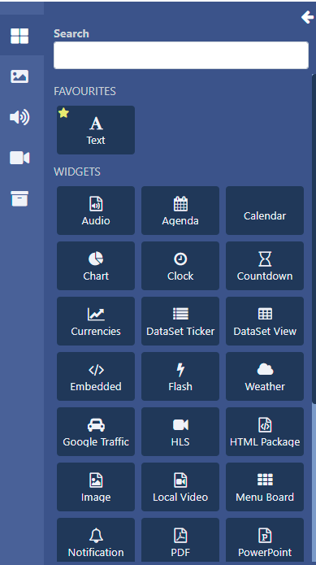
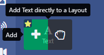
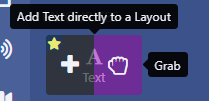
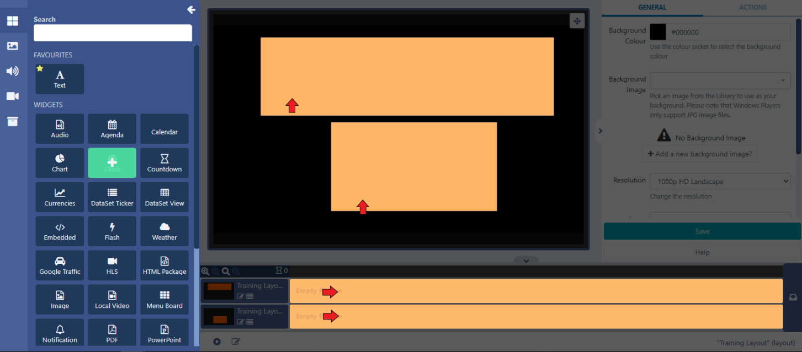
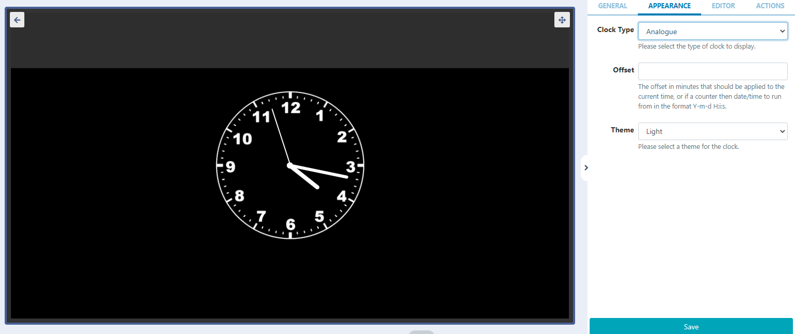
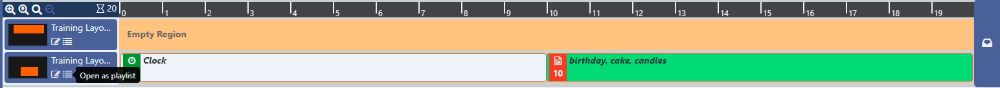
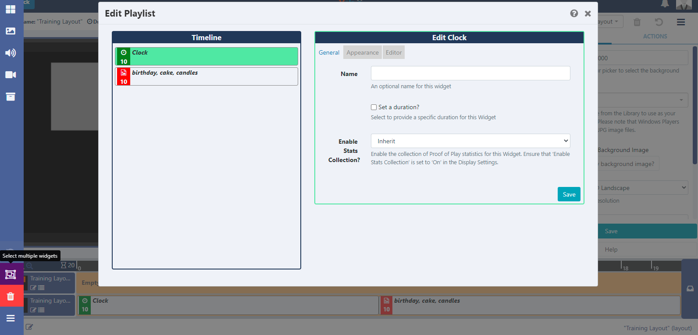

# Widgets

Add content to Layouts using the variety of Widgets available from the Toolbar in the Layout Designer:


```
Widgets that are available can be disabled/enabled by an Administrator in the Modules section of the CMS.
```

Use the Search field to easily find Widgets and mark as Favourite to group them together to make it easier for future selections.

- Hover over a Widget and select the star icon in the top left corner to mark as a favourite:
  

Click on the star to deselect and remove from favourites.

## Adding Widgets to Layouts

Clicking on a Widget will give you the option to click to Add


or Grab to drag and drop


- Add the Widget by clicking directly on, or dragging to, a target Region (this can be a Region in the viewer or the Timeline):
  
  Once added, the Widget can be configured using the available options for the selected Widget in the properties panel:
  

- Add Widgets to a specific point on the Timeline, by dragging or clicking on a marker to add.
  Widgets can also be added to a Region in a Playlist view:

- Click on the menu to the right of the Timeline.
  
  A Playlist view will open to add Widgets in the same way by clicking to add or drag and drop.
  

```
Use the Select Multiple Widgets button, located on the left hand side,
 to highlight multiple items on the Playlist to delete!
```

```
Make edits by clicking on the Widget on the Layout Timeline or in the Playlist view,
 to open the available options in the properties panel.
```
