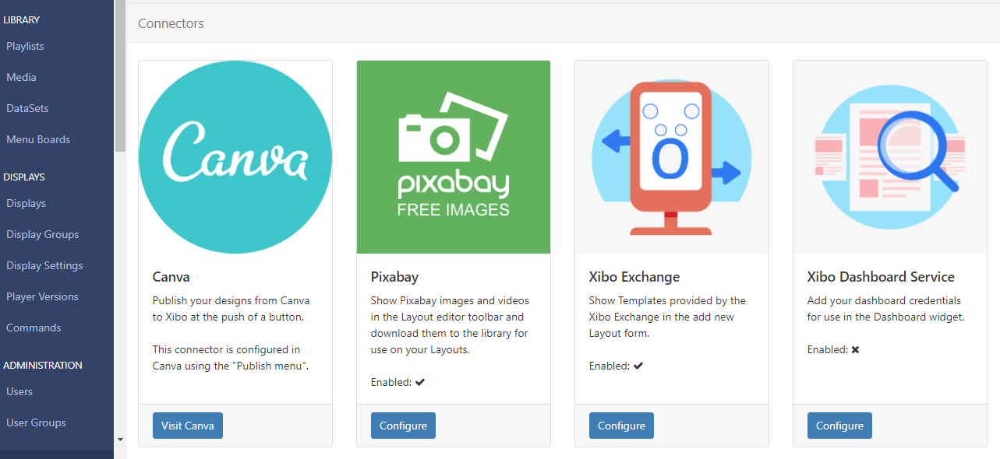
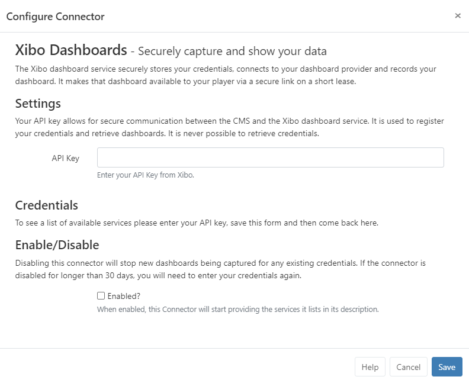
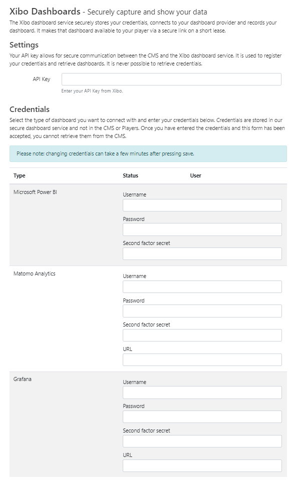

# Dashboard Service

The Sigma-DS Dashboards Service is a commercial feature which allows Users to securely display dashboard services; Microsoft Power BI, Grafana and Matomo, on Layouts with automation and authentication handled by Sigma-DS.

Please note: This commercial feature is available from v3.2.0 and requires an API for configuration as further explained here.

Once the Connector has been configured, add dashboards to display in Layouts using the Dashboards Widget

## Configure Connector

From the CMS:

- Click on Applications under the Administration section of the main menu.
- Scroll down to the Connectors section of the page.
- Click the Configure button for the Dashboard Service connector:
  
- Enter the API key you have been given (available in My Account).

```
- Customers on a Business or Enterprise Plan will have their API key pre-filled!
```

- Tick to Enable to start providing the dashboard services
  
- Click to Save.
- Click the Configure button again for the Sigma-DS Dashboard service connector.

- Using the Credentials section of the form, select the dashboard service(s) you wish to use:
  
  Enter the following credentials:

- Username
- Password
- Two Factor Secret (if required)
- URL (if required)

```
Grafana does not support multi factor authentication, so please leave
 the Two Factor Secret field empty when configuring this - integration.
 Please see the following page for further information on obtaining a
  URL to use with this service, supported authentication - mechanisms and possible limitations Sigma-DS Dashboard Service
```

- Click to Save and wait a few moments whilst those credentials are successfully registered.
  Your Dashboard is ready to be added to Layouts using the Dashboard Widget
