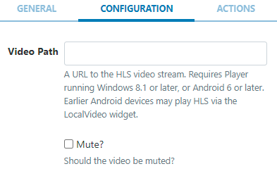

# HLS

Display live streamed HLS content on Layouts.

```
NOTE: This Widget requires a Player running Windows 8.1 or later/Android 6 or later. Earlier Android devices may play HLS using the Local Video Widget.
```

This Widget requires a valid internet connection on the Player in order to function.

## Add Widget

Locate HLS from the Widget toolbar and click to Add or Grab to drag and drop to a Region.

{verision} NOTE: If you are using a 1.8.x CMS, select HLS from the Widget Toolbox to add. {/version}

On adding, configuration options are shown in the properties panel:

- Provide a Name for ease of identification.
- Choose to override the default duration if required.

## Configuration


Provide a URL to the HLS Video stream.

Use the checkbox to mute/unmute the video stream.
