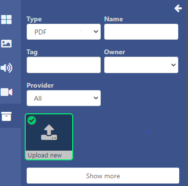
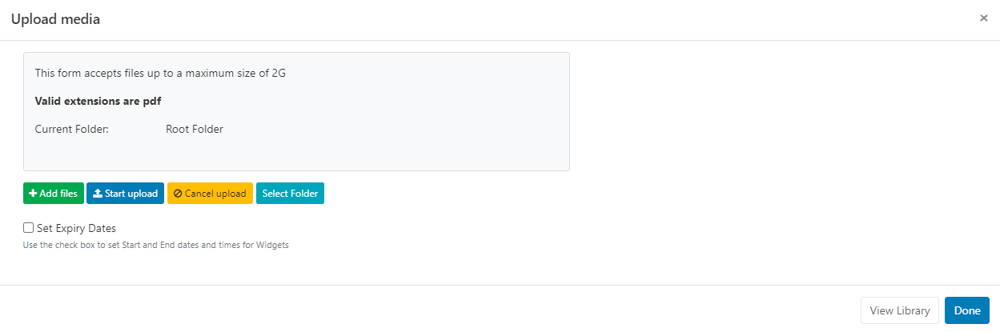
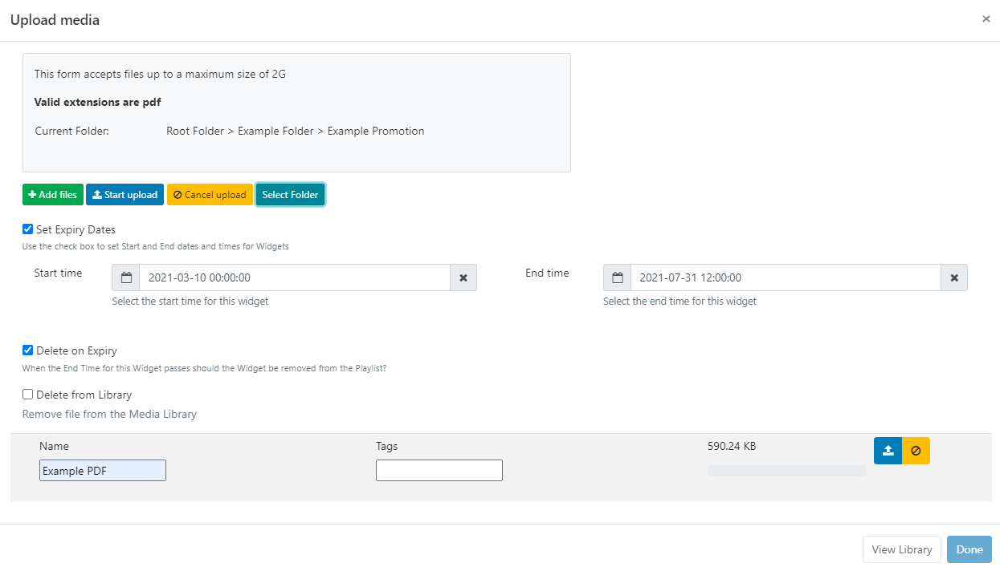
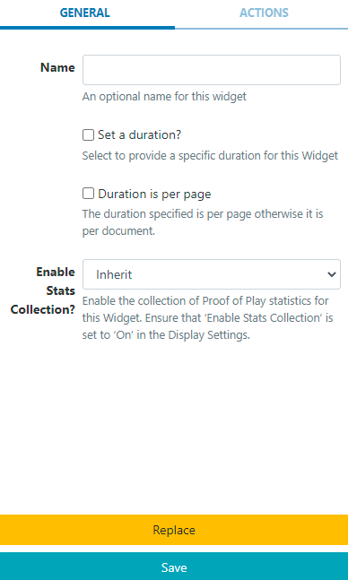

# PDF

Display PDF files on Layouts.

```
NOTE: If you are using a CMS earlier than v3.0.0 please use the following link: PDF
```

## Add Widget

Locate PDF from the Widget toolbar and click to Add or Grab to drag and drop to a Region.

Use the Library Search function to add PowerPoint files already uploaded to the Library.

```
NOTE: From v3.1.0 use the Library other media search and filter by Type to select Upload new and add to a Layout:
```



## Upload Media File

The file uploader will open on adding the PDF Widget:


This uses pdfjs to display PDF’s on the Player and in the Layout Designer.

- Click on Add files and select the file(s) to upload

```
Files can also be added via drag and drop!
```

- Give your file a Name for easier identification in the CMS and an optional Tag.

```
If the Name field is left blank, the file will be named as per the original file name on upload!
```

PDF files can also be directly uploaded to a specified Folder location.

```
PDF files that are saved in Folders will inherit the View, Edit, Delete Share options that have been applied to the destination Folder for User/User Group access!
```

There is an option to Set Expiry Dates and times for files uploaded to this particular Widget.

```
This is particularly useful should you need to preload PDF’s to be shown at a later date/time!
```

- Tick the Set Expiry Dates box.

```
Please note: Expiry Dates are currently not supported for the Linux Player!
```



- Select Start and End dates and times.

- Use the check boxes to remove the media file from the Playlist on expiry and delete from the Library.

- Click the Start upload button to begin the upload of all files added. If a Folder/Expiry Dates have been selected and there are multiple files to be added, all files will be uploaded to the specified location and have the same Expiry Dates set.

- Once successfully uploaded, click Done.

Files can also be uploaded individually and have different Folder locations/Expiry dates and times specified. Instead of clicking on the Start upload button, click on the blue upload button shown at the end of the row for an added file.

```
View or make changes to Expiry Dates by clicking on the icon on the Widget from the Timeline!
```

## Configuration Options

Click on the added PDF Widget from the Timeline to open configuration options in the properties panel:


`- Make edits to naming of the Widget if required.

- Tick the Set a duration to provide a specific duration for the entire PDF.

or

- Provide a duration and use the checkbox to apply the duration to each page of the PDF.
