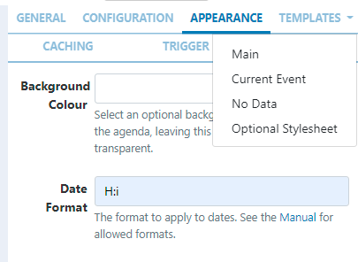
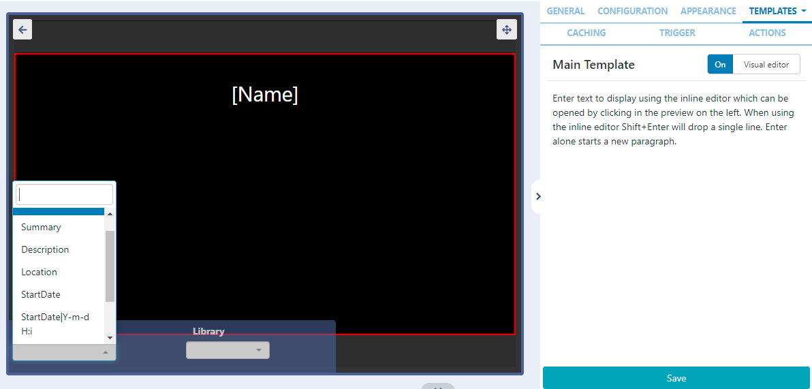

# Agenda

Display an agenda pulled from an iCal feed on Layouts.

```
NOTE: If you are using a CMS earlier than v3.1, please use the following link: Calendar
```

## Add Widget

Locate Agenda from the Widget toolbar and click to Add or Grab to drag and drop to a Region.

On adding, configuration options are shown in the right hand properties panel:

- Provide a Name for ease of identification.

- Choose to override the default duration if required.

- Select whether the duration is to be per item or leave unticked to set the duration per feed.

## Configuration


- Provide the iCal URL to link.

```
Ensure that the ICS feed URL is available to the CMS. If the feed loads in a browser without authentication then the feed should display in the CMS without issue.
For further information on how to view your Google Calendar in applications, use the following link selecting the Get your calendar (view only) option: https://support.google.com/calendar/answer/37648?hl=en

```

- Use the Interval field to filter events for a certain period. Use natural language such as ‘1 day’ or ‘2 weeks’ to return the events within your chosen time frame.
- Tick the checkbox to enter a Date range instead with defined start and end dates.
- Specify the Number of items/events you wish to display from the iCal feed.
- Select to Exclude all day events which will be removed from the feed and not shown.
- Select to Show only current events which will hide all other events from the feed.
- Select to Exclude current events to remove from the feed and not be shown
- Choose to Use event timezone or deselect to use the CMS timezone instead.
- Choose to Use calendar timezone if the feed specifies that it’s own timezone should be used. Deselect to use the CMS timezone.
- If your feed comes from Windows use this check box.

## Appearance

- Select an optional Background Colour or leave blank to stay transparent.
- Use the Date Format field to ensure that you show the appropriate date/time formats for your events.

```
Take a look at the table at the bottom of this page for PHP date formats!
```

- Use the checkbox to show calendar items side by side.

- Select an Effect using the drop-down menu to be used to transition between items.

When an effect is selected an additional option is shown to specify the number of events to show per page.

```
Use an effect when you have several events to display to prevent them being shown as static lists!

```

## Template

Click on the Templates tab:


### Main

- Toggle On the Visual editor to format the main template using the inline editor.
- Click the edit icon to open.
  
- Include text merge fields from the Snippets menu to pull in the required event information from the feed.

```
[Date] fields can include an optional format [Date|format] so that [Date] can be used multiple times in a Template with different formats to allow for different styling for each element of a date.

```

- Click to Save.

### Current Event

Set alternative text and formatting to show Current Events. Sigma-DS will use the Players date/time to work out if the event showing is current and switch to the Current Event template.

- Tick the box to Use an alternative template for Current Events.
-
- Include text and select from the available Snippets to create a template to be used just for Current Events.
-
- Save changes.

## No Data Template

This template allows a user to include a message to ensure that the intended audience is not left with blank displays when no events are returned from the iCal feed.

## Optional Style Sheet

Include CSS to apply to the template structure.

## Caching

Include a suitable time for the Update Interval in minutes, keeping it as high as possible. This determines how often data will be requested from the iCal feed. If the calendar is only ever modified with events scheduled days in advance, you can set this for a long period.

```
It is best practice to contact a remote feed as little as possible.
```

### Trigger

Use this tab to trigger a Web Hook Action when there is a Current Event or No Event!

```
Example Scenario:

A user has a meeting room calendar configured using the Agenda Widget on a Layout which shows the current occupancy for a room and would like to change LED lights to show when vacant or in use.

The user would first need to create Shell Commands which issued commands to an LED IoT device or the inbuilt LEDS’s on some of the Philips Commercial Displays.
Next an Interactive Action would need to be defined on the Layout, which would Navigate to Widget and Target the Screen, with the Shell Command Widgets configured in the Interactive Drawer.
Using the Trigger tab on the Agenda Widget, assign the code’s to trigger the Web Hooks for Current Event and No Event.
See the Commands Functionality page for more information.
```

## Actions

Interactive Actions can be attached to this Agenda Widget from the Actions tab in the properties panel. Please see the Interactive Actions page for more information.

```
Take a look at the Agenda Module Guide to see an example of how you can utilise the Agenda Widget in your Layouts!

```

## Date Format - PHP

this should accept any date format that is in a correct PHP date format, the following characters are recognised and can be used:

 <!-- table remains -->
