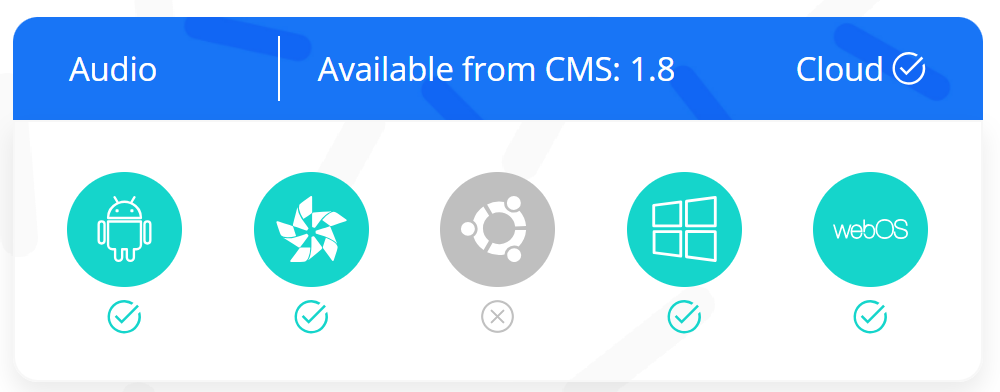
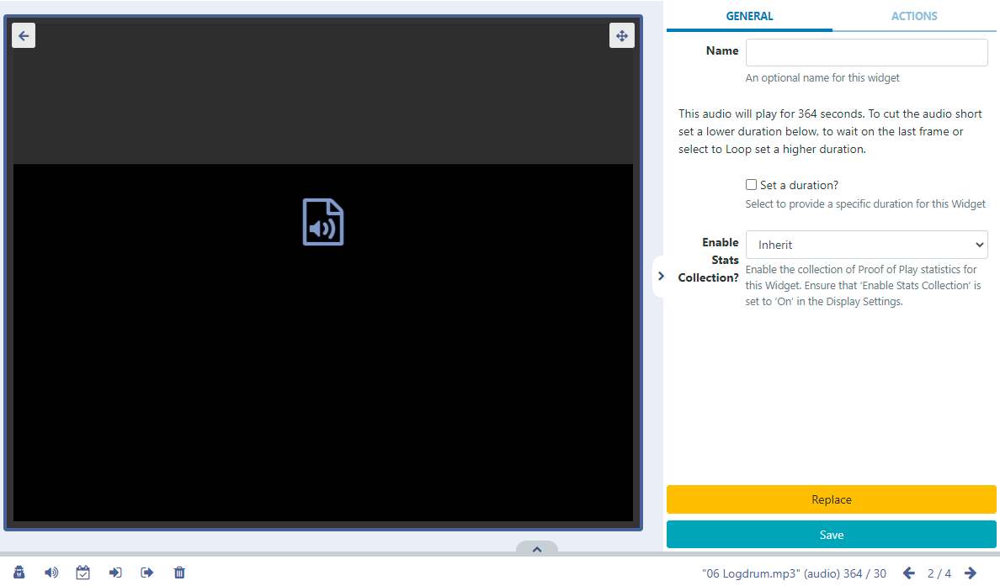
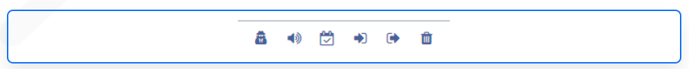

# Audio

Add audio to Layouts.

```
NOTE: If you are using a CMS version earlier than 3.1, please use the links below:
- v3.0.x CMS, please click here
- CMS earlier than v3.0.0 please click here
```


Uploaded audio files are cached for off-line playback which can then be added to Layouts.

Audio files can be uploaded to the Library or uploaded directly to Layouts using the Audio Library Search function from the Toolbar in the Layout Designer.

## Configuration Options

Once added to a Layout, click on the Audio file icon in the Timeline or Viewer to open configuration options in the right hand properties panel:


- Provide an optional Name if required.
- Here you can see how long the audio will play for.
- Tick the Set a duration to provide a specific duration for the audio file.

```
With Set a duration ticked you can set a lower duration to cut the file short or select a higher duration and use the Loop function!
```

Use the Context Menu at the bottom of the viewer to apply further options to the Audio Widget.


```
This menu can also be easily accessed by highlighting the Audio Widget in the Layout and using a right click! See the Layout Designer page for further information!
The Audio Widget is fully compatible with Overlay Layouts and can therefore be used effectively to draw attention and compliment content.

```

## Actions

Interactive Actions can be attached to this Audio Widget from the Actions tab in the properties panel. Please see the Interactive Actions page for more information.
