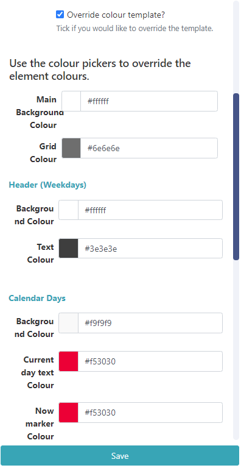

# Calevdar

Display a Schedule, Daily, Weekly or Monthly calendar views pulled from an iCal feed.

```
NOTE: If you are using a CMS earlier than v3.1, please click here
```

# Add Widget

Locate Calendar from the Widget toolbar and click to Add or Grab to drag and drop to a Region.

On adding, configuration options are shown in the right hand properties panel:

- Provide a Name for ease of identification.
- Choose to override the default duration if required.

## Configuration

- Provide the iCal URL to link.

```
Ensure that the ICS feed URL is available to the CMS. If the feed loads in a browser without authentication then the feed should display in the CMS without issue.
For further information on how to view your Google Calendar in applications, use the following link selecting the Get your calendar (view only) option: https://support.google.com/calendar/answer/37648?hl=en

```

- Use the drop down to select the type of calendar to use to display events:
  

### Schedule

- Include a Message to be shown when no events are returned.

- Use the Interval field to filter events for a certain period. Use natural language such as ‘1 day’ or ‘2 weeks’ to return the events within your chosen time frame.

- Tick the checkbox to enter a Date range instead with defined start and end dates.

## Daily/Weekly

- Set Start and End times to define a window to show events.

```
NOTE: From v3.1.2, an additional option to remove Weekends is available for both Weekly and Monthy Calendar Types!
```

- All Calender Types have the following options:
- Exclude all day events to remove from the feed so they won’t be shown.
- Exclude current events to remove from the feed so they won’t be shown.
- Use event timezone or deselect to use the CMS timezone instead.
- Use calendar timezone if the feed specifies that it’s own timezone should be used. Deselect to use the CMS timezone.
- If your feed comes from Windows use this check box.

## Appearance

Depending on the Calendar Type selected, configure the Appearance using the available options:

Schedule

- Choose to provide a Time Format to replace the default HH:mm.
- Use the checkbox to show a now marker on the calendar for the current time.
- Use the checkbox to show event descriptions for events that have them in the iCal feed.
- Set a Text Scale, 1 being the lowest.
- Select from a Light or Dark colour scheme to apply to the template.
  Daily
- Choose to provide a Time Format to replace the default HH:mm.
- Use the checkbox to show a now marker on the calendar for the current time.
- Set a Text Scale, 1 being the lowest.
- Enter a Grid step duration in minutes to apply to rows of events.
- Select from a Light or Dark colour scheme to apply to the template.
  Weekly
- Choose to provide a Time Format to replace the default HH:mm.

- Use the checkbox to show a now marker on the calendar for the current time.
-
- Set a Text Scale, 1 being the lowest.
-
- Select from a Long, Medium, Short Week name length to apply.
-
- Enter a Grid step duration in minutes to apply to rows of events.
-
- Select from a Light or Dark colour scheme to apply to the template.

Monthly

- Choose to provide a Time Format to replace the default HH:mm.
- Use the checkbox to show a now marker on the calendar for the current time.
- Tick to enable showing a header.
- Set a Text Scale, 1 being the lowest.
- Select from a Long, Medium, Short Week name length to apply.
- Select from a Light or Dark colour scheme to apply to the template.
  All calendar types have the option to provide alternative colours by using the checkbox to Override the colour template to change all elements of the selected calendar:



## Caching

Include a suitable time for the Update Interval in minutes, keeping it as high as possible. This determines how often data will be requested from the iCal feed. If the calendar is only ever modified with events scheduled days in advance, you can set this for a long period.

```
It is best practice to contact a remote feed as little as possible.
```

## Trigger

Use this tab to trigger a Web Hook Action when there is a Current Event or No Event!

```
Example Scenario:

A user has a meeting room calendar configured using the Calendar Widget on a Layout which shows the current occupancy for a room and would like to change LED lights to show when vacant or in use.

- The user would first need to create Shell Commands which issued commands to an LED IoT device or the inbuilt LEDS’s on some of the Philips Commercial Displays.
- Next an Interactive Action would need to be defined on the Layout, which would Navigate to Widget and Target the Screen, with the Shell Command Widgets configured in the Interactive Drawer.
- Using the Trigger tab on the Calendar Widget, assign the code’s to trigger the Web Hooks for Current Event and No Event.
See the Command Functionality page for more information.

```

## Actions

Interactive Actions can be attached to this Calendar Widget from the Actions tab in the properties panel. Please see the Interactive Actions page for more information.

## Time Format - PHP

This should accept any time format that is in a correct PHP time format, the following characters are recognised and can be used:
