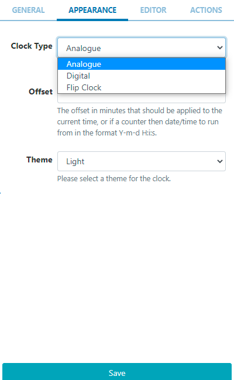
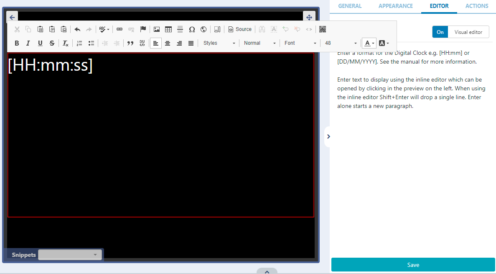

# Clock

Display an analogue, flip or digital clock in Layouts.

# Add Widget

Locate Clock from the Widget toolbar and click to Add or Grab to drag and drop to a Region.

```
NOTE: If you are using a 1.8.x CMS, select Clock from the Widget Toolbox to add!
```

On adding, configuration options are shown in the properties panel:

- Provide a Name for ease of identification.
- Choose to override the default duration if required.

## Appearance

Use the drop-down menu to select the type of clock to display:


- Analogue is a traditional clock face available in a Light or Dark theme (black or white face).
- Digital has an additional Editor tab to enter formatting.
  Enter text or HTML in the box provided or toggle on the Visual editor and click on the edit icon to access the inline editor:


Use the editor to select font, size, colour and use Snippets to include available merge fields.

```
See the section at the bottom of the page for further information on date/time formats!
```

```
NOTE: If you are using 1.8.x CMS, use the text editor at the bottom of the form to format!
```

- Flip Clock is a pre-formatted clock that animates a “flip” for each hour, minute and seconds (optional) elapsed.

```
The Flip Clock has Hourly, Minute and Daily Counter options which can run from a specified date/time to give a countdown!
```

## Actions

Available from v3.0.0

Interactive Actions can be attached to this Clock Widget from the Actions tab. Please see the Interactive Actions page for more information.

### Available Formatting

Date / time can be formatted by providing “tokens” that sit between square brackets [] in the template area.
