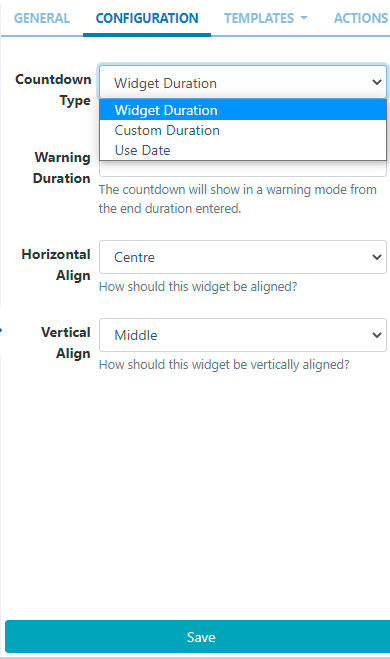
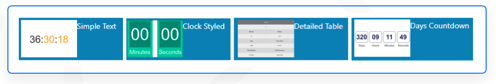
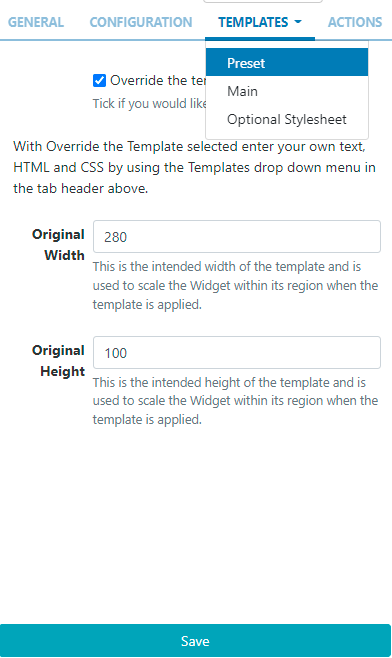

# Countdown

Display a countdown for a selected duration or until a specified date on Layouts.

## Add Widget

Locate Countdown from the Widget toolbar and click to Add or Grab to drag and drop to a Region.

On adding, configuration options are shown in the properties panel:

- Provide a Name for ease of identification.
- Choose to override the default duration if required.

## Configuration

Use the drop-down menu to select the type of countdown to display:


- Widget Duration - The countdown will be determined by the duration of the Widget.
- Custom Duration - Set a countdown duration in seconds.
- Use Date - Countdown to a selected date and time.
  Use the Warning Date to set at which point the countdown will change to a ‘warning mode’ for the remainder of the countdown.

```
The “warning” and “finished” status can be styled using the CSS style sheet on overriding a Template.
```

From v3.1.0 users can set Horizontal and Vertical alignments for this Widget!

## Templates

Click on the Templates tab and select from one of the preset templates available from the drop down menu.


## Editing Preset Templates

Preset templates can be edited by clicking in the Override the template checkbox.

```
The template will be automatically scaled and should be designed for the intended output resolution. The following guidelines should be considered when editing templates:
- Templates must be designed at a fixed size
- All elements must use absolute sizing in px, including fonts, margins, widths, heights, etc
- If positioning is used, it must be from top,left
- Templates can use bootstrap
- The aspect ratio will be fixed by Sigma-DS and sized to fit the Region
- Templates are treated the same as a static image
```

With override template selected, you can enter text, HTML and CSS.

Once override has been selected, click back on the Templates tab to select the templates to edit:


## Optional Stylesheet

This is the CSS to apply to the template structure above.

## Actions

Interactive Actions can be attached to this Countdown Widget from the Actions tab. Please see the Interactive Actions page for more information.

## Additional Information

Sigma-DS should accept any date format that is in a correct PHP date format, the following characters are recognised and can be used:

<!-- table needs -->
