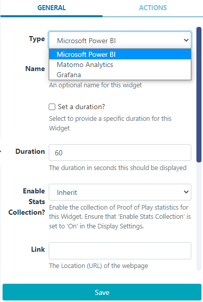
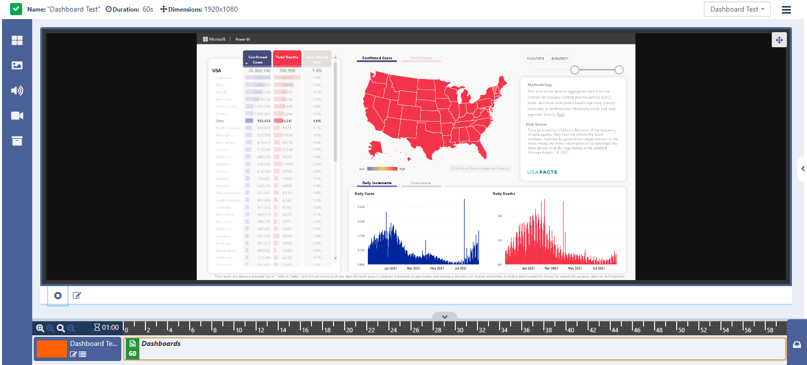
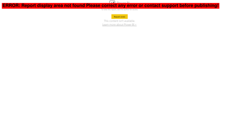

# Dashboards

The Dashboards Widget is used to display Dashboards that have been configured to use the Dashboards Service

Please note: This commercial Widget is part of the Sigma-DS Dashboard Service available from v3.2.0 and requires an API for configuration as further explained here

## Add Widget

Locate Dashboards from the Widget toolbar and click to Add or Grab to drag and drop to a Region.

On adding, configuration options are shown in the right hand properties panel:

- Use the drop down to select the dashboard service Type to use from the ones that have been configured in the connector.
- Provide a Name for easier identification.
- Choose to override the default Duration if required.
- In the Link field, enter the URL to embed from your chosen dashboard.

```
NOTE: The minimum refresh interval that can be entered per dashboard is 5 minutes as we do not support dashboard service updates more frequently than 5 minutes.
```

Please see the following page for further information on obtaining a URL to use with this service, authentication mechanisms and possible limitations Dashboard Service


- Save changes

```
Please note: On first entering a URL into the Dashboard Widget it may take a few moments to load as it is dependent on how long it takes to render your dashboard content, and how busy the service currently is.
Once you are showing your dashboards on displays, the service will keep your dashboards updated at the interval you specify so it will always be ready to show and appear instantly on Displays.

If you stop showing a dashboard on your displays for a time, then the service will stop refreshing it, but will start again automatically the next time that dashboard is shown.

```

```
Please note: By default, reports in Power BI render with a US Date format. To use an alternative date format add the following parameters to the URL you pass in the Dashboards Widget as shown with the example below for en-GB:
&language=en&formatLocale=en-GB

```


Please note: If Sigma-DS detects an error with a request for dashboard services, you will see a red banner message over the top of a screengrab to give an indication to the user where the problem has occurred. This will be shown in the Layout Designer previewer only for the logged in user. The Layout Preview and Displays showing the scheduled Layout will continue to show the last good capture or a spinner icon until the issue has been resolved.

Example Error message with screengrab shown below:


## Actions

Interactive Actions can be attached to this Dashboard Widget from the Actions tab in the properties panel. Please see the Interactive Actions page for more information.
