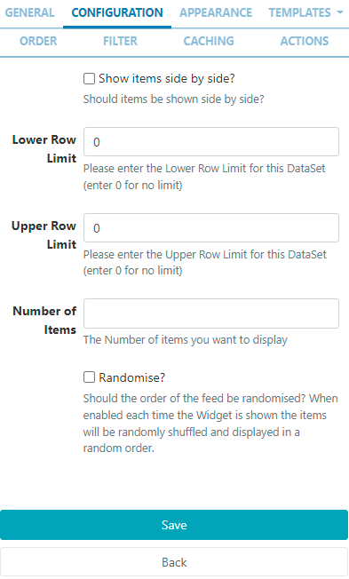
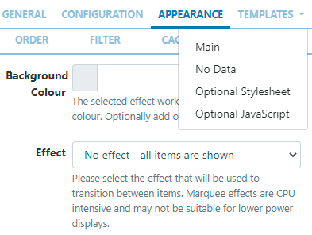
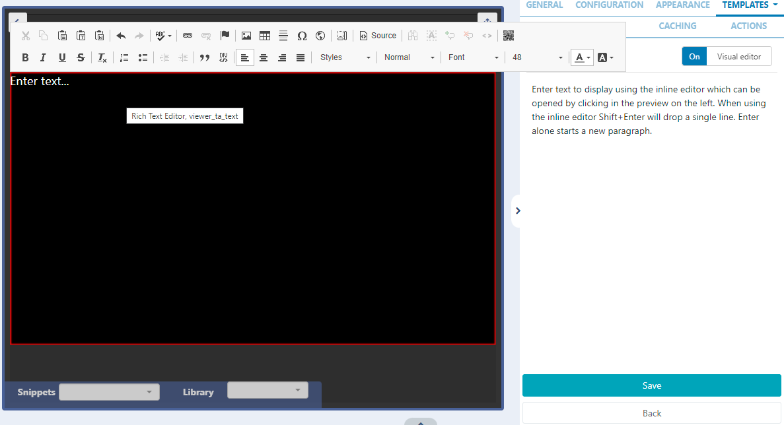

# DataSet Ticker

Display information held in a DataSet as a ticker on Layouts.

DataSets need to be created and defined prior to adding the DataSet Ticker Widget to Layouts. Please see the DataSet page for further information.

## Add Widget

Locate DatSet Ticker from the Widget toolbar and click to Add or Grab to drag and drop to a Region.

```
NOTE: If you are using 1.8.x CMS, DataSets can be displayed using a Ticker Widget. Please use the following link: Ticker 1.8
```

- On adding, select the DataSet to use from the drop-down menu.

```
NOTE: From v3.1.0 you can change to an alternative DataSet by clicking the Back button. Options will need to be reconfigured to suit the new DataSet!
If you are using a version earlier than 3.1.0 you cannont edit to change to an alternative set of data. A new Widget would need to be added and configured!
```

Once Saved, further options will be made available:

- Provide a Name for ease of identification.
- Choose to override the default duration if required.
- Select whether the duration is to be per item or leave unticked to set the duration per feed.

```
This should be used with caution as it can create long-running media
 items. It is recommended to use this setting in conjunction with
  a setting to limit the number of items shown!
```

## Configuration



- Select if returned items should be shown side by side and configure Upper and Lower row limits.
- Set the number of items you wish to display.

```
NOTE: From v2.3.8 use the Randomise option to randomly shuffle
 items to de displayed in a random sequence.
```

## Appearance

- Optionally select a background colour
- Use the drop-down menu to select an Effect to be used to transition between items.
- Set the Speed for the effect selected.
- Enter how many Items should appear on each page if an effect to split items has been selected.

## Templates

Click on the Template tab to show the DataSet Ticker Templates:


## Main Template

- Select Main

- Toggle On the Visual editor to format the main template using the inline editor.

- Click the edit icon to open.
  

` Include text merge fields from the Snippets menu to pull in the required information from the DataSet.

## No Data Template

Include a message to ensure that your audience is not left with blank displays when there is no data to display.

## Optional Stylesheet

Include CSS to apply to the template structure.

```
This optional template is intended for advanced users to ‘tweak’ the CMS generated output!
```

## Order

DataSet results can be set and ordered by any column:

- Select the column to order from the drop down menu.

- Click the + button to add additional fields.

- Use the advanced order clause for more complex ordering by providing a SQL command.

## Filter

DataSet results can be filtered by any column:

- Use the clause builder to include/omit DataSet results
- Click the + button to add additional fields.
- Use the advanced filter clause for more complex filtering by providing a SQL command.

## Caching

Players can cache the content of this media for off-line playback and to prevent repeated downloads. Keep this number as high as possible.

```
NOTE: From v3.0.0 set a ‘freshness check’ to determine when to switch to the No Data Template when a Player is offline!
```
