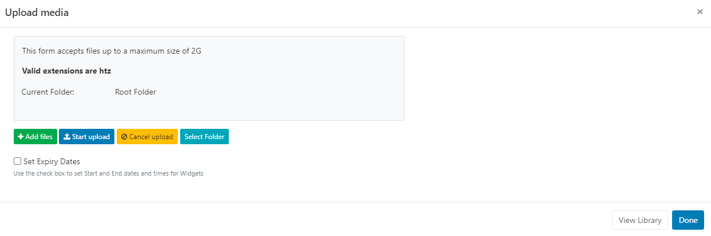

# HTML Package

The HTML Package Module allows for the upload of a complete HTML Package which can be distributed to Players.

```
NOTE: If you are using a v2.0 CMS please use the following link: HTML Package
```

## Add Widget

Locate HTML Package from the Widget toolbar and click to Add or Grab to drag and drop to a Region.

Use the Library Search function to add a HTML Package already uploaded to the Library.

```
NOTE: From v3.1.0 use the Library other media search and filter by Type to select Upload new and add to a Layout:
```


## Upload Media File

The file uploader will open on adding the HTML Package Widget:


- Click on Add files and select the file(s) to upload

- Give your file a Name for easier identification in the CMS and an optional Tag.

```
If the Name field is left blank, the file will be named as per the original file name on upload!
```

HTML Packages can also be directly uploaded to a specified Folder location.

```
HTML Packages that are saved in Folders will inherit the View, Edit, Delete Share options that have been applied to the destination Folder for User/User Group access!
```

There is an option to Set Expiry Dates and times for files uploaded to this particular Widget.

- Tick the Set Expiry Dates box.

- Use the date picker to select Start and End dates and times.
  
- Click the Start upload button to begin the upload.
- Once successfully uploaded, click Done.
  Files can also be uploaded individually and have different Folder locations/Expiry dates and times specified. Instead of clicking on the Start upload button, click on the blue upload button shown at the end of the row for an added file after changing the Folder location and Expiry dates, to upload individually.

```
View or make changes to Expiry Dates by clicking on the icon on the Widget from the Timeline!
```

## Configuration Options

Click on the added HTML Package Widget from the Timeline to open configuration options in the Edit HTML Package form:


- Using the General tab, make edits to the Name and provide a specific duration as required.
- Enter a file name for the Player to attempt to open after extracting the .htz archive.
- Save any changes.
