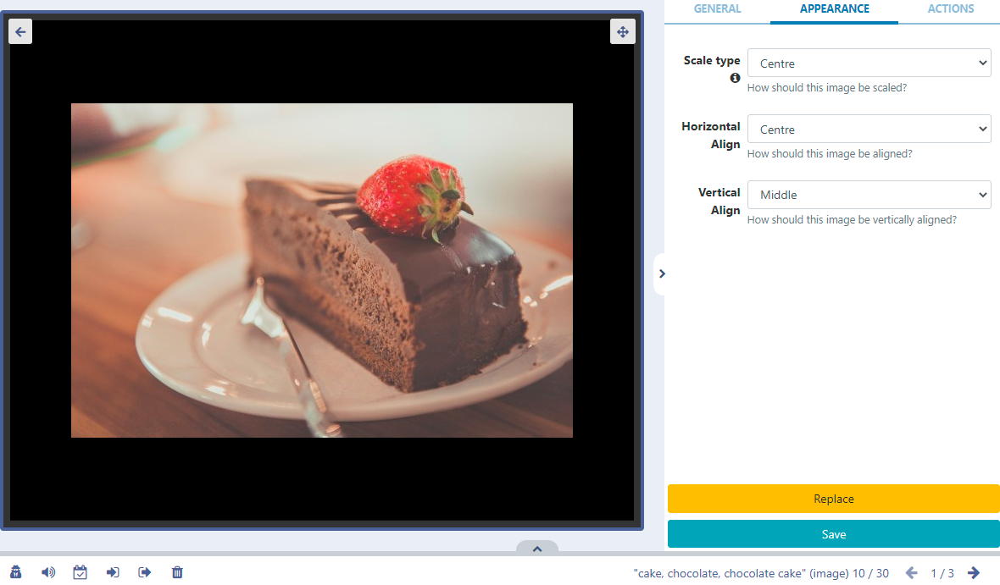

# Image

Display images on Layouts.

```
NOTE: If you are using a CMS earlier than v3.1, please use the links below:
v3.0 CMS, please click here
CMS earlier than v3.0, please click here
```

Image files can be uploaded to the Library or uploaded directly to Layouts using the Image Library Search function from the Toolbar in the Layout Designer.

```
Animated GIF’s are not supported on any Player!
```

## Configuration Options

Once added to Layouts, click on the Image file in the Timeline or Viewer to show configuration options in the the properties panel:

- Provide an optional Name if required.
- Tick the Set a duration to provide a specific duration in seconds.
  
- Use the Appearance tab to change the settings for Scale and Alignment of the image.

```
NOTE: From v3.1.0 Fit Scale type is available for Images!

Use the Context Menu to apply options to this Widget. Please refer to the Layout Designer page for further information!
```
