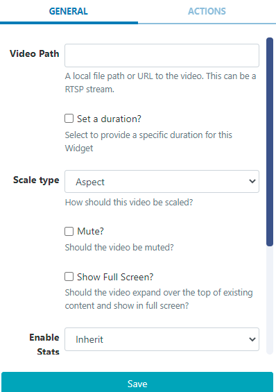

# Local Video

The Local Video Widget is used for video that exists only on the Display and is not uploaded to the CMS, such as;

- Manually transferred videos

- Videos on a LAN

- Streamed Videos

## Add Widget

Locate Local Video from the Widget toolbar and click to Add or Grab to drag and drop to a Region.

```
NOTE: If you are using a 1.8.x CMS, select Local Video from the Widget Toolbox to add!
```

On adding, configuration options are shown in the properties panel:


- Complete a local file path or URL to the video, this can be an RTSP Stream.

- Optionally Set a duration to override the default.

- Use the drop down to select how the video should be scaled.

- Use the checkbox to mute/unmute the video.

- Tick to expand the content over the top of existing to show full screen. (not available in versions earlier than 2.0)

```
NOTE: Video scaling and RTSP streams are only supported on the Android, webOS and Linux Players.
Use the HLS Widget to show compatible video streams on Window and Tizen Players.
```

```
The number of RTSP streams you can show on one Layout is dependent on the device being used.
```

```
NOTE: Transitions are not supported for the Tizen Player when using the Local Video Widget.
```
