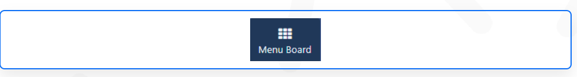

# Menu Board (Feature Preview)

```
Please note: This feature is a preview and should not be used in production.

Whilst we work on this to make improvements please be aware of the following limitations if you would like to try this feature:

- When creating Categories please be aware that available Templates will only display 3 or 4 Categories in Portrait and 3, 4 or 5 in Landscape
- Product descriptions do not have a maximum character length which could result in descriptions being incorrectly displayed in a chosen template.
- Any Allergy information completed in the Product form will automatically show.
- There is no limit to the amout of Product Options a Product can have which could result in them being incorrectly displayed if more than 2 are created.
- Product Options does not have a maximum character length which could result in descriptions being incorrectly displayed.
This feature preview is not available for Sigma-DS Cloud hosted Customers.

```

The Menu Board Widget is used with Menu Boards to display Menu information.

Menu Boards need to be first created prior to adding the Menu Board Widget to Layouts, Please see the Menu Boards page for further information.

## Add Widget

Click on Menu Board from the Widget toolbar and click to add or drag and drop


On adding, select from the following options in the properties panel:

- Use the drop down to select which Menu to use as the source.
- Set the Orientation to use.
- Choose a Template to apply (based on the selected orientation).

```
(Legacy) Templates are compatible with older Player/Browser versions!
```

- Click to Save.
  Next add Categories to the menu structure by dragging and dropping to the empty spaces:
  

```
Once a Menu has been associated with a Widget you can change to an alternative Menu as well as change the Orientation and Template by clicking the Back button. Categories will need to be reselected for the chosen Menu Structure!
```

Once Saved, further options will be made available:

- Provide a Name for ease of identification.
- Choose to override the default duration if required.

## Configuration


- Use the check box to show Products that are set as Unavailable in greyed out text.
- Option to select an alternative Font to the default.
- Select Products to show Highlighted in the Category list.
- If your Widget is not full screen, select Horizontal and Vertical alignment options.

## Appearance

- This tab allows Users to select alternative colouring to the default options used by the selected template.

- Toggle On/Off Images that have been attached to Products.

- Toggle On/Off the name of the Menu Board as a Header.

## Caching

Players can cache the content of this media for off-line playback and to prevent repeated downloads. Keep this number as high as possible.
