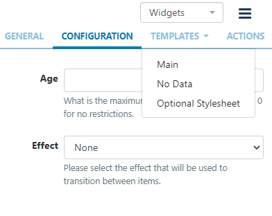
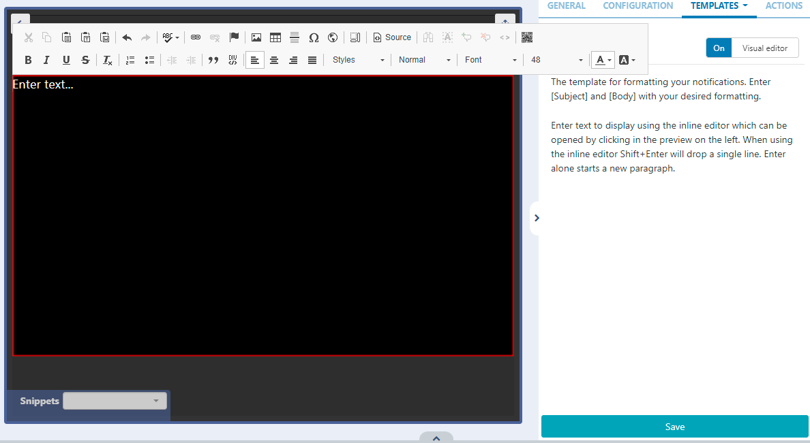

# Notifications

Display messages created in the Notification Drawer of the CMS on Layouts.

## Add Widget

Locate Notification from the Widget toolbar and click to Add or Grab to drag and drop to a Region.

```
NOTE: If you are using a v1.8.x CMS, select Notification from the Widget Toolbox to add!
```

On adding, configuration options are shown in the properties panel:

- Provide a Name for ease of identification.

- Choose to override the default duration if required.

- Select if the duration should be per Notification or a total duration for ALL Notifications.

## Configuration

- Complete a maximum notification Age for messages you wish to use in this Widget.
- Select an optional Effect and transition Speed for the selected effect from the drop-down menu.

## Templates

Click on the Template tab to format available templates:


## Main

- Enter HTML in the box provided or toggle On the Visual editor to format the template using the inline editor.
- Click the edit icon to open.
  
- Include the text merge fields to format from the Snippets menu, to pull in the Subject and Body information from the Notification Drawer.
- Click on the Save button.

## No Data Template

This template allows a user to include a message to ensure that the intended audience is not left with blank displays when there are no Notifications to display.

## Optional Style Sheet

Include CSS to apply to the template structure.
