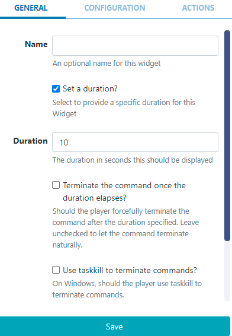
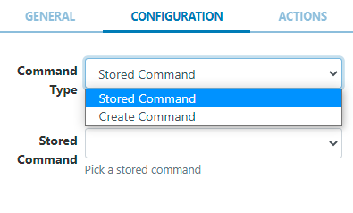
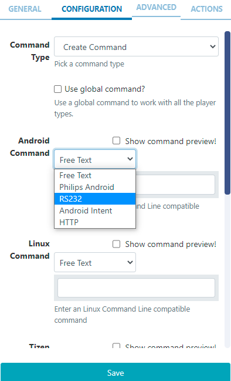

# Shell Command

The Shell Command Module is used to instruct the Display to execute a command outside of the Sigma-DS environment, using the operating system shell.

```
NOTE: If you are using a CMS earlier than v3.0.0 please use the following link: Shell Command
```

```
This Module is disabled by default for Sigma-DS Cloud Hosted customers. If you would like to utilise the Shell Command functionality to execute actions on loading a Layout, then please contact our help desk via My Account to request to have this Module enabled.
```

The Command is executed when a Layout containing the Shell Command Widget plays at its scheduled time.

A Shell command can be a created command string which is passed directly to the shell or a preconfigured stored command.

Click here for further information regarding Command Functionality

## Add Widget

Locate Shell Command from the Widget toolbar and click to Add or Grab to drag and drop to a Region.

On adding, configuration options are shown in the properties panel:

- Provide a Name for ease of identification.
- Tick the Set a duration box and provide a Duration to forcibly stop the process. Leave unticked to leave the command to run to its natural conclusion.
  

```
In most cases, commands that are run from a Layout tend to be background commands which trigger something to happen like screen on/off or restart the device etc. In such cases, leave the box unticked.
If you need to run a command for a fixed period of time, for example where your command shows something on the screen for a time and cannot close itself, Sigma-DS can be instructed to terminate the command it started running by ticking the box and specifying a duration.

```

## Configuration



- Use the drop down to select from the Command Type options:
  Stored Command - allows a user to pick a predefined command from the drop down menu.
  Create Command - use the command builder and select from the available options to create a command.
  
- Select Free Text to enter a command string or use the drop down menu to select from the available Commands to configure.

- Tick to use a global command and enter a Command Line compatible command to work with all Player types.

With Create Command selected, an Advanced tab is made available to enable launching the command via Windows Command Line (cmd.exe).

```
Add the Shell Command Widget to Layouts to execute external commands, such as ‘volume up’ for a Layout with an Audio Widget that is set to play, and ‘volume down’ when the Layout finishes.

For commands that are executed on a specific date/time, such as ‘reboots’, ‘turn on/off’ on opening/closing times for example, then please see Events in the Scheduling section and Send Command in the Displays section of this User Manual.

```

```
NOTE: Android/Linux Players require root access to use Shell Commands.
```

### Actions

Interactive Actions can be attached to this Shell Command Widget from the Actions tab. Please see the Interactive Actions page for more information.
