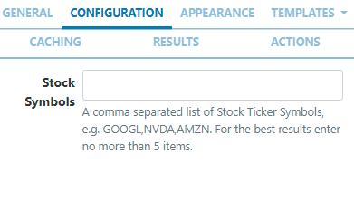
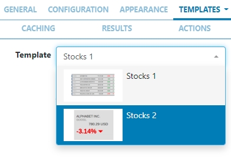
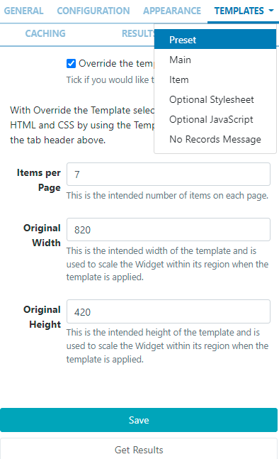

# Stocks

Display trade price information for stock listings on Layouts.

```
The Stocks Module is configured for Xibo Cloud hosted customers with an API key provided as part of the service, so please skip the installation steps detailed below and continue from the Add Widget section.
```

## Installation

The Stocks Widget relies on the Alpha Vantage Stock API to retrieve stock market data. The prices returned by Alpha Vantage follow the stock market standard of adjusting for corporate events such as splits and dividend payout.

Prior to installation you will need an API key. Please visit Alpha Vantage to create an account and obtain a key.

The Stocks Module is installed from the Modules page, under the Administration section of the main CMS menu.

- Click on the Install Module button and select the Stocks Module to install.
  Once installed:

- Select the Stocks Module from the grid and use the row menu to select Edit.

- Complete the form fields and include the API key and specify Cache settings.

# Add Widget

Locate Stocks from the Widget toolbar and click to Add or Grab to drag and drop to a Region.

```
NOTE: If you are using a 1.8.x CMS, select Stocks from the Widget Toolbox to add.
```

On adding, configuration options are shown in the properties panel:

- Provide a Name for ease of identification.
- Choose to override the default duration if required.
- Select whether the duration is per item, unticked the duration will be per page / number of items.

## Configuration



- Include a list of comma separated Stock Symbols (Ticker) to return results.

```
If you need a stock symbol that is only quoted on a specific exchange then you can use the format SYMBOL:EXCHANGE to return results.
Stock symbols can be found on various lookup sites such as Yahoo Finance!

```

## Appearance

- Optionally choose a background colour using the colour picker.
- Include a PHP Date Format to apply to returned results, (see the bottom of the page for date formats).
- Select an optional Effect and Speed to be used to transition between items.

```
NOTE: From v3.1.0 users can set Horizontal and Vertical alignment options for this Widget!
```

## Templates

Select from the available Templates:

- Preset - use the drop down to select one of the preset templates
  

```
Click to Override the selected template if required.
Please see the section on Editing Preset Templates below for further information.

```

- No Records Message provide a message to display when there are no records returned.

## Editing Preset Templates

Templates can be edited by selecting a Template using the drop-down and clicking in the Override the template checkbox.

```
The template will be automatically scaled and should be designed for the intended output resolution. The following guidelines should be considered when editing templates:
- Templates must be designed at a fixed size
- All elements must use absolute sizing in px, including fonts, margins, widths, heights, etc
- If positioning is used, it must be from top,left
- Templates can use bootstrap
- The aspect ratio will be fixed by Xibo and sized to fit the Region
- Templates are treated the same as a static image
```

Once override has been selected, click back on the Templates tab to select templates to edit:

!!


Main Template - Toggle On the Visual editor to access the inline editor to enter text and formatting or provide text/HTML in the box provided.

```
NOTE: The Visual editor is not available in a 1.8.x CMS.
```

### Item Template -

Enter a Template to be applied to each item, use the Visual editor or provide text/HTML in the box provided.

### Optional Stylesheet -

This is the CSS to apply to the template structure above.

```
This optional template is intended for advanced users to ‘tweak’ the CMS generated output!
```

## Caching

Include a suitable time for the Update Interval in minutes, keeping it as high as possible.

## Results

Get results at anytime to see what data is returned. Any field is available as a substitute to use in a template by simply entering the field name between square brackets [].

## Actions

Available from v3.0.0

Interactive Actions can be attached to this Stocks Widget from the Actions tab. Please see the Interactive Actions page for more information.
