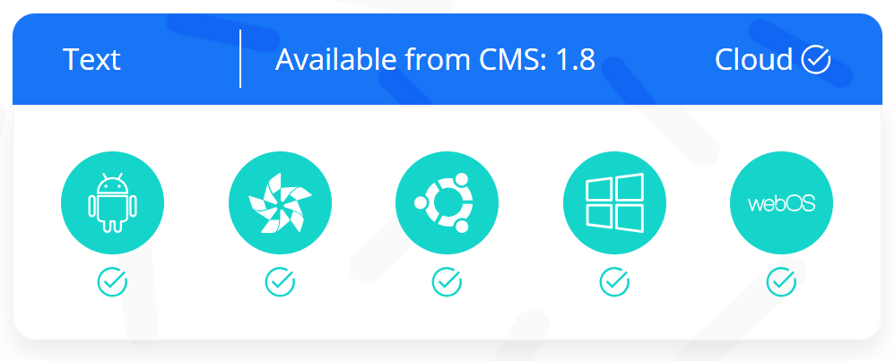
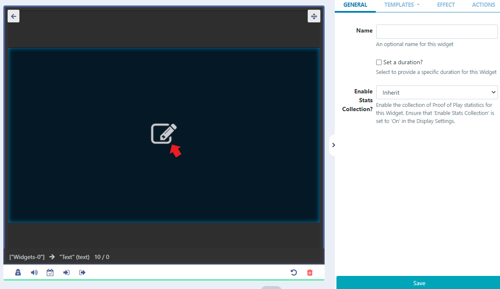

# Text

Add text to display on Layouts.


## Add Widget

Locate Text from the Widget toolbar and click to Add or Grab to drag and drop to a Region.

```
NOTE: If you are using a 1.8.x CMS, select Text from the Widget Toolbox to add.
```

## Text Editor


Click the edit icon in the Preview window to open the inline editor to enter text and apply formatting.


The text editor will open with the same background as selected for the Layout and will use a complimentary text colour for the chosen background colour.

The thin red border in the text editing window represents the Region size. Ensure that formatted text remains within this border.

Optionally include date/time merge tags, available from the Snippets menu.

```
NOTE: From v2.1.0, [Date] tags can include an optional [Date|format] so that [Date] can be used multiple times in a Template each with different formats!
```

Configuration options are shown in the Edit Text form:

- Provide a Name for ease of identification.
- Choose to override the default duration if required.

## Effect

- Optionally select a Background Colour to use.
- Select an Effect to use from the dropdown menu.
- Include a Speed for the selected effect.
- Include a selector to use for stacking marquee items in a line when scrolling left/right.

## Templates

Select from the available Templates:

Main Template - Toggle Off the Visual editor to enter text/HTML in the box provided.
Optional JavaScript Template - Provide JavaScript in the box provided.

```
Additional Fonts can be added to this editor by uploading files to the Library. Please be aware that fonts have ‘preferences’ built into them known as OS/2 tags. Xibo checks these OS/2 preferences, and can use fonts with OS/2 tags 0 or 8. Fonts with other tags may not display correctly or you may receive an error on upload.
```

## Actions

Available from v3.0.0

Interactive Actions can be attached to this Text Widget from the Actions tab in the properties panel. Please see the Interactive Actions page for more information.

## Date Format - PHP

Date / time can be formatted by providing “tokens” that sit between square brackets [] in the template area.
