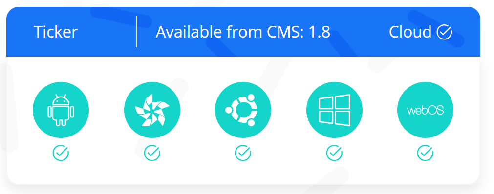
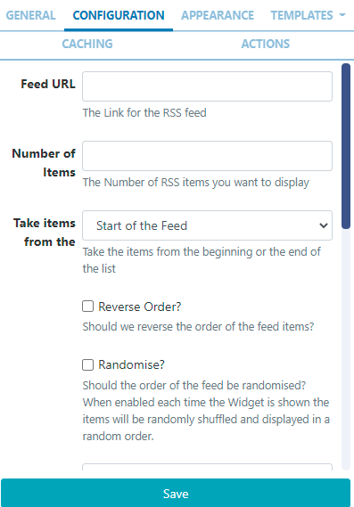
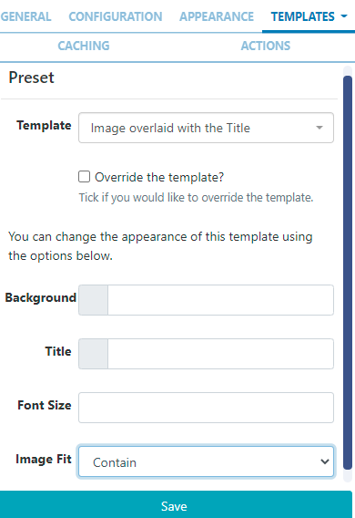
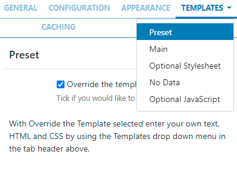

# Ticker

Display dynamic feed content on Layouts.

```
NOTE: If you are using a 1.8.x CMS, please use the following link: Ticker 1.8
```


The Ticker Widget primarily consists of a data source location and a template to apply to the retrieved data.

## Add Widget

Locate Ticker from the Widget toolbar and click to Add or Grab to drag and drop to a Region.

On adding, configuration options are shown in the properties panel:

- Provide a Name for ease of identification.

- Choose to override the default duration if required.

- Select whether the Duration is per item or leave unticked to set the duration per feed.

```
Use the last option with caution as this can create long-running media items. Use in conjunction with Number of items to limit!
```

## Configuration



- Enter the Feed URL to use.
-
- Choose how many RSS items to display.
-
- Select to start with items from the Start or End of the list.
-
- Tick to select to Reverse Order feed items.
-
- Select to display items in a Random order.

```
The Randomise option works offline; the entire feed is parsed, rendered and downloaded to the Player and then sorted in a random fashion for display. We use a Durstenfeld shuffle to randomise the order of items. Randomise works on the full feed, “Number of items” and “Take items from” options.
```

- Display a Copyright notice at the end of the feed.
-
- Tick to display returned results side by side.
-
- Apply a Date Format to apply to all returned date results. (see the Additional Information at the bottom of this page for further - information).
-
- Include a comma-separated list of attributes that should not be stripped from the incoming feed.
-
- Include a comma-separated list of HTML tags to be stripped from the feed.
-
- Tick to Decode the HTML entities in the feed before parsing it.
-
- Select to Disable Date Sort for the feed.

## Appearance

- Optionally select a Background Colour.
- Use the drop-down menu to select an Effect to be used to transition between items.
- Set the Speed for the effect selected.
- Enter how many Items should appear on each page if an effect to split items has been selected.

## Templates

Select from the available Templates:

```
- Preset - use the drop down to select one of the preset templates
NOTE: From v3.1.0 additional options have been included so that users
 can easily change the appearance of a selected Template by changing
  alternative colours, font sizing and image fit options.

```

Click to Override the selected template if required.
Please see the section on Editing Preset Templates below for further information. {/tip}

- No Data provide a message to display when no data is returned from the feed.

## Editing Preset Templates

Templates can be edited by selecting a Template using the drop-down and clicking in the Override the template checkbox.

```
The template will be automatically scaled and should be designed for the
 intended output resolution. The following guidelines should be considered when editing templates:
- Templates must be designed at a fixed size
- All elements must use absolute sizing in px, including fonts, margins, widths, heights, etc
- If positioning is used, it must be from top,left
- Templates can use bootstrap
- The aspect ratio will be fixed by Xibo and sized to fit the Region
- Templates are treated the same as a static image
```

Once override has been selected, click back on the Templates tab to select the template to edit:



- Main Template - Toggle On the Visual editor to access the inline editor to enter text and formatting or provide text/HTML in the box provided.

- Include text merge fields from the Snippets menu to pull in the required information from the feed.

```
A special notation is available where the User can specify the
 Tag|Namespace within the feed for Xibo to extract content.
```

Optional Stylesheet - This is the CSS to apply to the template structure above.

```
This optional template is intended for advanced users to ‘tweak’ the CMS generated output!
```

## Caching

Players can cache the content of this media for off-line playback and to prevent repeated downloads. Keep this number as high as possible.

```
Options are provided to set different update frequencies for images
and data to determine how long the Player will keep the data and or
images, saved locally, before checking for updates.
```

## Actions

Available from v3.0.0

Interactive Actions can be attached to this Ticker Widget from the Actions tab. Please see the Interactive Actions page for more information.

## Date Format - PHP

This should accept any date format that is in a correct PHP date format, the following characters are recognised and can be used:

<!-- table remains -->
