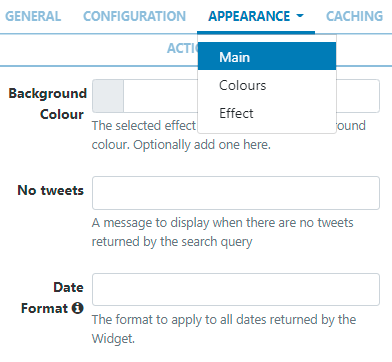
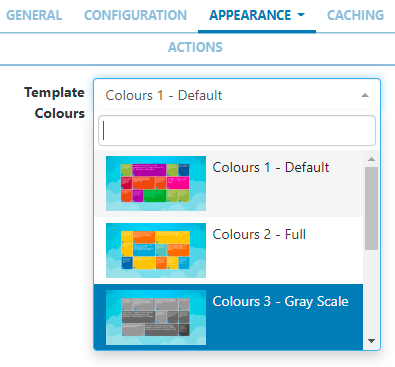
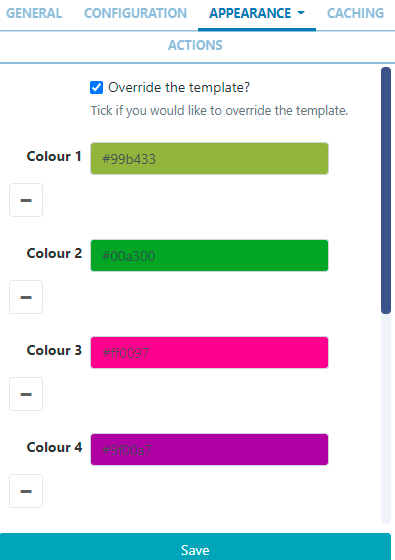

# Twitter Metro

Display metro tiles of Twitter feeds on Layouts.

The Twitter Metro Module provides access to the Twitter Search API. Granted access is to read data only!

```
The main set-up is provided as part of the service for Sigma-DS Cloud hosted customers. Please follow the simplified process below to connect to the Twitter API.

- Select Modules from the Administration section of the menu.
- Click on the row menu for the Twitter Provider (Twitter Search) Module and select Connect to Twitter.
- A form will open which has a Login with Twitter button which allows authorisation for the CMS to connect via a Twitter account.
- Follow the on-screen instructions to authorise.
Skip the installation section below and go straight to the Add Widget section.
```

## Installation

Access to the Twitter API is protected and so users must register for an API key which is then entered into the Twitter Metro Module in the Sigma-DS CMS.

### Connecting to Twitter

- Obtain an API key and API secret from Twitter and then log in to your Twitter account.
  Please note: You will need to apply for a Twitter developer account if you are not already approved, using the above Twitter link.

- Complete the required fields and accept the Terms of Service.
- Solve the CAPTCHA and submit the form.
- Make a note of the generated consumer key (API key) and consumer secret (API secret).

### Twitter Metro Module Installation

- Select the Modules page under the Administration section and install the Twitter Metro Module.
- Once installed click on the row menu for the Twitter Metro Module and click Edit.
- Enter the generated API key and API secret.
- Optionally adjust the Cache Period to determine how long to cache a results set for each Twitter search.

```
Setting a low value can cause your access to the Twitter API to be disabled for generating too many requests.
```

## Add Widget

Locate Twitter Metro from the Widget toolbar and click to Add or Grab to drag and drop to a Region.

```
NOTE: If you are using a 1.8.x CMS, select Twitter Metro from the Widget Toolbox to add!
```

```

The Twitter Metro Widget will automatically size portrait/landscape based on the size of the Region that it is added to. It will resize as if it were an image for best consistency across all display resolutions.
```

On adding, configuration options are shown in the properties panel:

- Provide a Name for ease of identification.
- Choose to override the default duration if required.

## Configuration

- Provide a Search Term to return applicable Tweets

```
Check to make sure your search term is valid before entering here by using the twitter.com search box!
```

```
To return Tweets from a specific account rather than all Tweets that contain the accounts @ handle, use from: before the name of the account in the Search Term field.
```

- Select the Language to use
- Use the drop down to select the Type of Tweets to be returned; based on popularity, most recent or a mixed.
- Select the Distance in miles, away from your location Tweets should be returned from. 0 has no restrictions.
- Enter the number of Tweets to return. Left blank the default number is 60.
- Select the Content Type of the Tweets to return using the drop down menu. Select from All Tweets/Tweets with Text only/Tweets with - Text and Images.
- Use the tick box if Mentions (@someone) should be removed from the returned Tweet text.
- Use the tick box if Hashtags (#something) should be removed from the returned Tweet text.
- Use the tick box to remove URLs from returned Tweet Text.

```
 Most URL’s do not compliment Digital Signage!
```

## Appearance

Use the Appearance tab to edit the Main template, apply Colours and select Effects to be used to transition between Tweets.


### Main

- Optionally add a Background Colour.
- Provide a No Tweets message to display when there are no Tweets to return, based on the search query.
- Apply the Date Format to use for returned results (see Additional Information at the bottom of page).

### Colours



- Use the drop down menu to select the colour palette to be applied.
- Select the Override the template box to define alternative colouring.
  
- Click in a colour bars to re-select using the colour picker.
- Remove selections completely by clicking - or add additional using +
- Ensure that you Save your changes.

### Effect

- Select an optional Effect and Speed to be used to transition between Tweets, to apply to each tile.

### Caching

Include a suitable time for the Update Interval in minutes, keeping it as high as possible. This determines how often the Module will request data from your feed.

## Actions

Available from v3.0.0

Interactive Actions can be attached to this Twitter Metro Widget from the Actions tab. Please see the Interactive Actions page for more information.

## Date Format - PHP

Sigma-DS should accept any date format that is in a correct PHP date format, the following characters are recognised and can be used:
