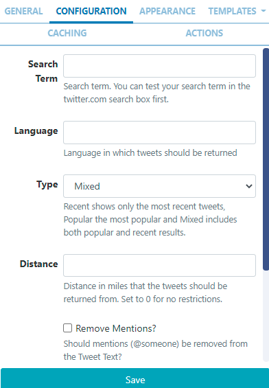
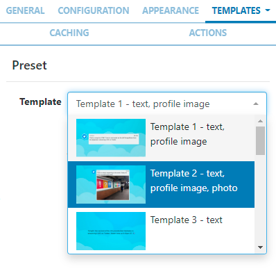
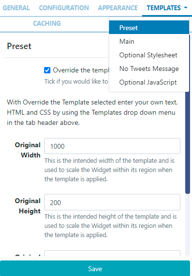

# Twitter

Display Twitter feeds on Layouts.

The Twitter Module provides access to the Twitter Search API. Granted access is to read data only!

```
The main set-up is provided as part of the service for Sigma-DS Cloud hosted customers. Please follow the simplified process below to connect to the Twitter API.

- Select Modules from the Administration section of the menu.
- Click on the row menu for the Twitter Provider (Twitter Search) Module and select Connect to Twitter.
- A form will open which has a Login with Twitter button which allows authorisation for the CMS to connect via a Twitter account.
- Follow the on-screen instructions to authorise.
Skip the installation section below and go straight to the Add Widget section.
```

## Installation

Access to the Twitter API is protected and so users must register for an API key which is then entered into the Twitter Metro Module in the Sigma-DS CMS.

### Connecting to Twitter

- Obtain an API key and API secret from Twitter and then log in to your Twitter account.
  Please note: You will need to apply for a Twitter developer account if you are not already approved, using the above Twitter link.

- Complete the required fields and accept the Terms of Service.
- Solve the CAPTCHA and submit the form.
- Make a note of the generated consumer key (API key) and consumer secret (API secret).

## Twitter Module Installation

- Select the Modules page under the Administration section and install the Twitter Module.
- Once installed click on the row menu for the Twitter Module and click Edit.
- Enter the generated API key and API secret.
- Optionally adjust the Cache Period to determine how long to cache a results set for each Twitter search.

```
Setting a low value can cause your access to the Twitter API to be disabled for generating too many requests.
```

## Add Widget

Locate Twitter from the Widget toolbar and click to Add or Grab to drag and drop to a Region.

```
NOTE: If you are using a 1.8.x CMS, select Twitter from the Widget Toolbox to add!
```

On adding, configuration options are shown in the properties panel:

- Provide a Name for ease of identification.
- Choose to override the default duration if required.
- Select whether the duration is to be per item or leave unticked to set the duration per feed.

## Configuration



- Provide a Search Term to return applicable Tweets

```
Check to make sure your search term is valid before entering here by using the twitter.com search box!
To return Tweets from a specific account rather than all Tweets that contain the accounts @ handle, use from: before the name of the account in the Search Term field.

```

- Select the Language to use
- Use the drop down to select the Type of Tweets to be returned; based on popularity, most recent or a mixed.
- Select the Distance in miles, away from your location Tweets should be returned from. 0 has no restrictions.
- Use the tick box if Mentions (@someone) should be removed from the returned Tweet text.
- Use the tick box if Hashtags (#something) should be removed from the returned Tweet text.
- Use the tick box to remove URLs from returned Tweet Text.

```
Most URL’s do not compliment Digital Signage!
```

## Appearance

- Optionally add a Background Colour.
- Specify the number of Tweets to return, left blank will return the default number of 15
- Select the number of Tweets to show Per Page, left blank will show the default number of 5 Tweets.
- Apply a Date Format to be used for returned results (see Additional Information at the bottom of page).
- Select an optional Effect and Speed to be used to transition between tweets.

```
NOTE: From v3.1.0 users can set Horizontal and Vertical alignment options for this Widget!
```

## Templates

Select from the available Templates:

Preset - use the drop down to select one of the preset templates:


```
Click to Override the selected template if required. Please see the
 section on Editing Preset Templates below for further information.
```

- No Tweets Message provide a message to display when there are no Tweets to return based on the search query.

## Editing Preset Templates

Templates can be edited by selecting a Template using the drop-down and clicking in the Override the template checkbox.

```
The template will be automatically scaled and should be designed for the intended output resolution. The following guidelines should be considered when editing templates:
- Templates must be designed at a fixed size
- All elements must use absolute sizing in px, including fonts, margins, widths, heights, etc
- If positioning is used, it must be from top,left
- Templates can use bootstrap
- The aspect ratio will be fixed by Sigma-DS and sized to fit the Region
- Templates are treated the same as a static image
```

Once override has been selected, click back on the Templates tab to select templates to edit:


**Main ** - Toggle On the Visual editor to access the inline editor to enter text and formatting or provide text/HTML in the box provided.

- Use the Snippets menu to include merge text fields.

```
NOTE: If you are using 1.8 the following substitutions are available for use: [Tweet][User] [ScreenName][Date] [ProfileImage][Photo]
```

Optional Stylesheet - This is the CSS to apply to the template structure above.

```
This optional template is intended for advanced users to ‘tweak’ the CMS generated output!
```

### Caching

Include a suitable time for the Update Interval in minutes, keeping it as high as possible. This determines how often the Module will request data from the feed.

## Actions

Available from v3.0.0

Interactive Actions can be attached to this Twitter Widget from the Actions tab. Please see the Interactive Actions page for more information.

### Date Format - PHP

Sigma-DS should accept any date format that is in a correct PHP date format, the following characters are recognised and can be used:
