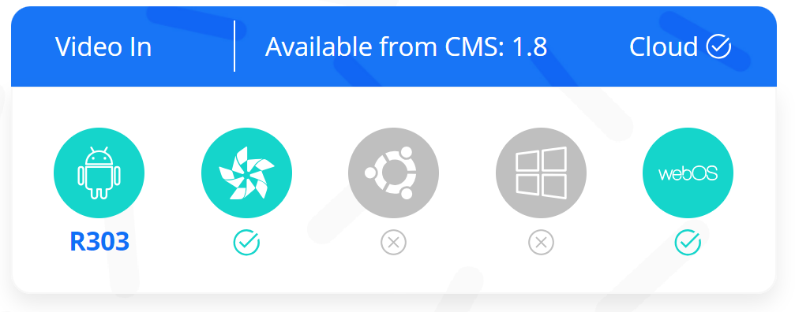
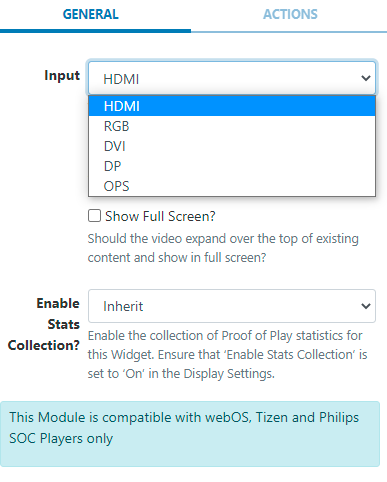

# Video In

Display input from an external source on SoC Displays.

Android only supports Phillips monitors to utilise this Widget!

## Add Widget

Locate Video In from the Widget toolbar and click to Add or Grab to drag and drop to a Region.

```
NOTE: If you are using a 1.8.x CMS, select Video In from the Widget Toolbox to add.
```



- Use the drop down menu to select which device input should be shown.

```
HDMI input will only support HDMI 1
```

- Choose to override the default duration if necessary.
- Tick to expand the video over existing content and therefore play in full screen.

```
NOTE: Transitions are not supported for the Tizen Player when using the Video In Widget.
```

## Actions

Available from v3.0.0

Interactive Actions can be attached to this Video In Widget from the Actions tab in the properties panel. Please see the Interactive Actions page for more information.

```
To seamlessly show content alongside Live TV create an Overlay Layout with the Video In Widget added, this will allow for your layout of content ‘underneath’ to display and rotate freely. This will prevent the TV signal from skipping with each Layout load if on the same Layout.
```
