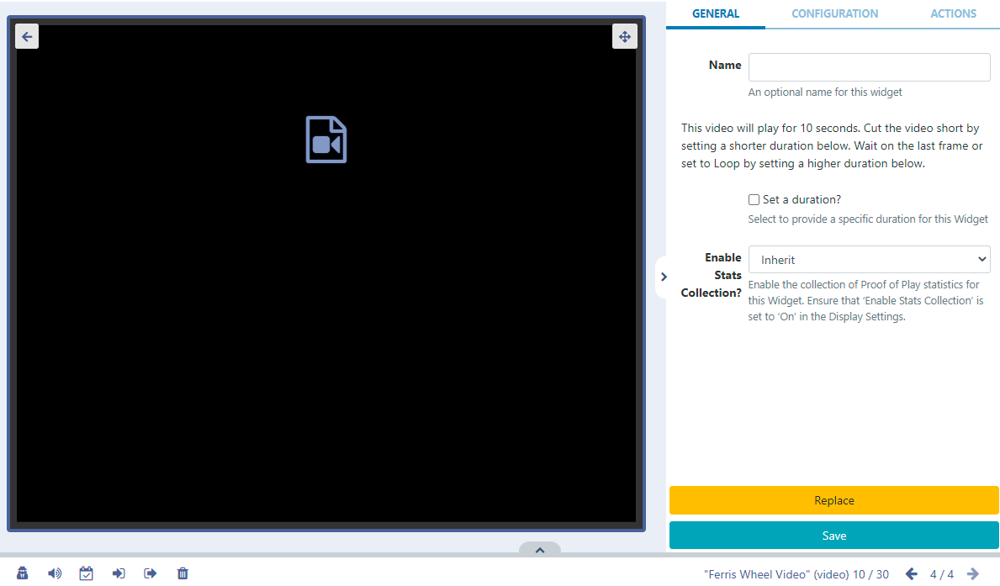
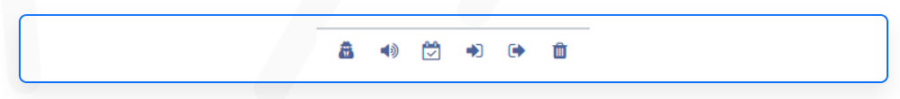

# Video

Display video on Layouts

```
NOTE: If you are using a CMS earlier than v3.1, please select from the links below:
- v3.0.x CMS, please click here
- CMS earlier than v3.0.0 please click here
```

Uploaded video files are cached for off-line playback which can then be added to Layouts.

Video files can be uploaded to the Library or uploaded directly to Layouts using the Video Library Search function from the Toolbar in the Layout Designer.

## Configuration Options

Once added to a Layout, click on the Video file icon in the Timeline or Viewer to open configuration options in the right hand properties panel:


- Provide an optional Name if required.
  Here you can see how long the video will play for.

- Tick the Set a duration to provide a specific duration for the Video file.

```
With Set a duration ticked you can set a lower duration to cut the file short or select a higher duration and use the Loop function!
```

## Configuration

- Use the Configuration tab to select the Scale type for the video.

```
Note: Scaling is currently supported by Android, webOS and Tizen Players (from v2 R200) and Windows Players (from v2 R253).
```

If the video has audio this can be muted by ticking the box.

- If you tick to Show Full Screen, the video will show full screen whilst it is playing. When the next item in the Timeline is shown it will revert back to the size of the Region.

```
NOTE: Transitions are not supported for the Tizen Player when using the Video Widget.
```

Use the Context Menu at the bottom of the viewer to apply further options to the Video Widget.


```
This menu can also be easily accessed by highlighting the Video Widget in the Layout and using a right click! See the Layout Designer page for further information!
```

## Actions

Interactive Actions can be attached to this Video Widget from the Actions tab in the properties panel. Please see the Interactive Actions page for more information.
