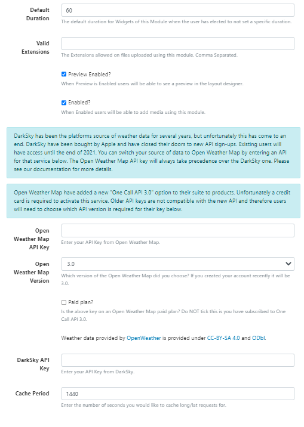
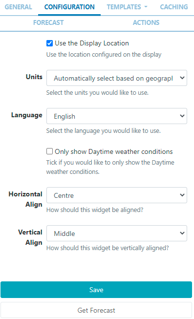
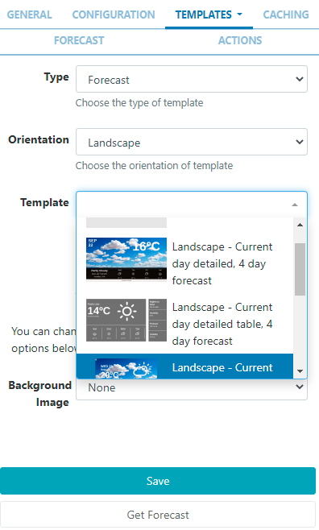
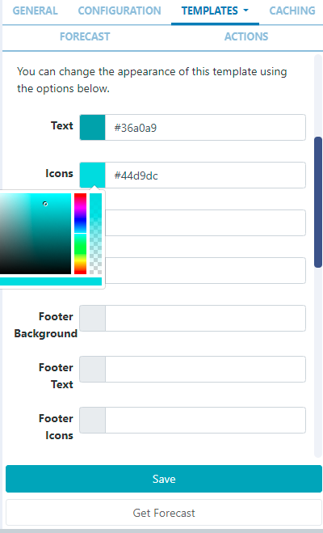
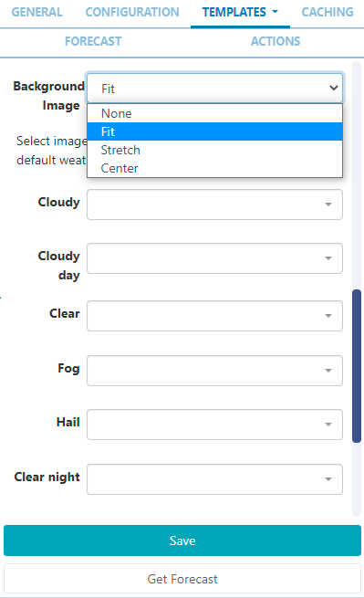
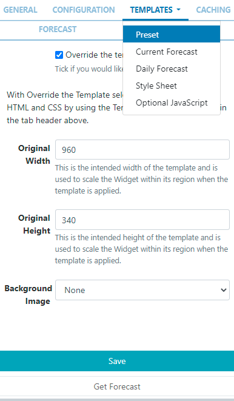

# Weather

Display daily weather forecasts on Layouts.

```
The Weather Module is fully configured for Xibo Cloud hosted customers and is provided as part of the service.
```

## Installation

Weather data is provided by OpenWeather which is provided under CC-BY-SA and ODbL

To get an API key please visit Open Weather Map to create an account.

```
Please note: Since the release of Open Weather’s One Call 3.0, new users must enter credit card details to use the free x number of calls Key or opt for a paid subscription!
Open Weather Map allows 1000 requests for a forecast, per day before charging a small fee for each subsequent request.

Paid plans unlock a 16 day forecast as well as other optimisations in the way the data is pulled through.

```

The Weather Module is installed from the Modules page, under the Administration section of the main CMS menu:

- Click on the Install Module button and select the Weather Module to install.
  Once installed:

- Select the Weather Module from the grid and use the row menu to select Edit.

- Complete the form fields and include the API Key:
  

- Once you have entered your API Key use the drop down menu to select the Open Weather Map Version.
- If you have subscribed to a Paid Plan ensure that you tick the box.
- The CMS allows a Cache period to be specified which will create a delay between requests for each geographic location.

## Add Widget

The Open Weather Map Terms of Service https://openweathermap.org/terms should be read and understood before using this Widget.

Locate Agenda from the Widget toolbar and click to Add or Grab to drag and drop to a Region.

On adding, configuration options are shown in the properties panel:

- Provide a Name for ease of identification.
- Choose to override the default duration if required.

## Configuration



- Tick to use the Display Location or untick to manually enter Latitude and Longitude to be used for this Widget.
- Use the drop down menu to select the Unit of measurement or opt for the automatic selection (first item) which will be based on - the geographic location.
- Select the Language to be used.
- Use the checkbox to Only show Daytime weather conditions.
- Use the Horizontal and Vertical alignment options to position the Widget within its Region.

## Templates

It provides a selection of Preset Templates for ease of use.

On selecting Preset, choose the Type and Orientation and use the drop down to select an available Template matching your entered criteria:

On selecting a Template, options will be made available to change the appearance of the template using the colour picker or providing the Hex if known:

When a Background Image has been selected, images uploaded to the Library can be used to replace the images provided by default:


# Editing Preset Templates (Advanced Use)

Preset templates can be edited by clicking in the Override the template checkbox.

```
The template will be automatically scaled and should be designed for the intended output resolution. The following guidelines should be considered when editing templates:
- Templates must be designed at a fixed size
- All elements must use absolute sizing in px, including fonts, margins, widths, heights, etc
- If positioning is used, it must be from top,left
- Templates can use bootstrap
- The aspect ratio will be fixed by Xibo and sized to fit the Region
- Templates are treated the same as a static image
```

With override template selected, you can enter text, HTML and CSS.

Once override has been selected, click back on the Templates tab to select templates to edit:


# Current Forecast Template

Also known as the main template, used for the current weather conditions and as the basis for the repeating Daily Forecast Template.

Toggle On the Visual editor to access the inline editor to enter text and formatting or provide text/HTML in the box provided.

Use the drop down to include Snippets.

```
Click on Get Forecast to see available substitutions to use.
```

## Daily Forecast Template

This is the repeating template that should be provided for the 7 day forecast. It will be repeated each day and then substituted into the special [dailyForecast] tag (which should feature on the main Current Forecast template).

The [dailyForecast] tag has 2 optional settings which can be added to the tag by including the| character. These are [dailyForecast|Number of days|Start day] and default to 7 days, starting at tomorrow (day 2). If you wanted to see the next 3 days you would use [dailyForecast|3] and for a 3 day forecast starting the day after tomorrow you could use [dailyForecast|3|3].

A common example is to ignore the “Current Template” and produce a full 7 day forecast using the Daily Forecast - this is achieved with [dailyForecast|7|1].

## Style Sheet

This is the CSS to apply to the template structure above.

```
This optional template is intended for advanced users to ‘tweak’ the CMS generated output!
```

## Attribution

All Layouts that use the Weather Widget need to include attribution, available by using the [Attribution] tag. All preset templates contain this tag by default, please ensure that this tag is included when editing/overriding default templates.

## Caching

Enter the Update Interval to be applied, in minutes, kept as high as possible.

```
If the data will only change once per hour the Update Interval could be set to 60.
```

## Get Forecast

It is possible to request a forecast at any time to see what forecast data is returned. Any field is available as a substitute in the template by entering the field name between square brackets - for example [nearestStormDistance].

## Actions

Interactive Actions can be attached to this Weather Widget from the Actions tab in the properties panel. Please see the Interactive Actions page for more information.

## Date Format - PHP

Xibo should accept any date format that is in a correct PHP date format, the following characters are recognised and can be used:
