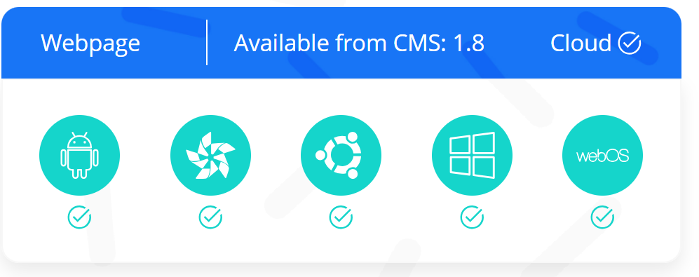
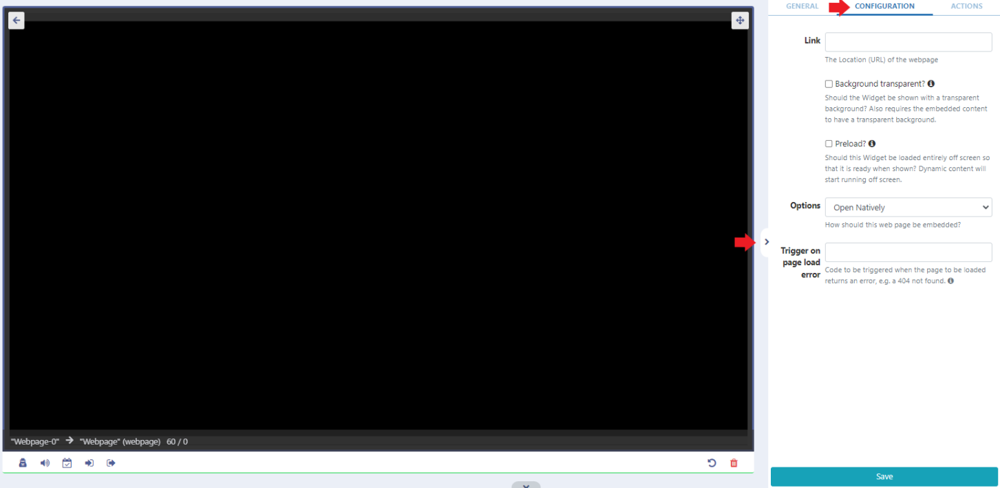
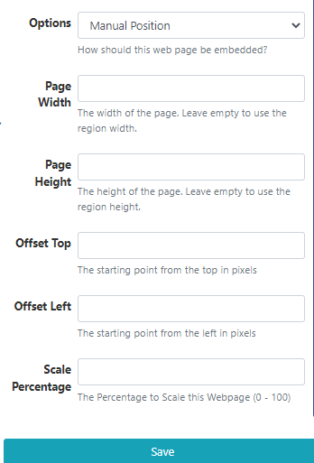
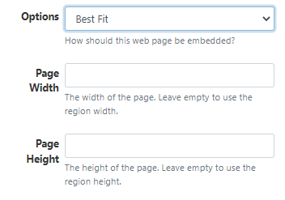
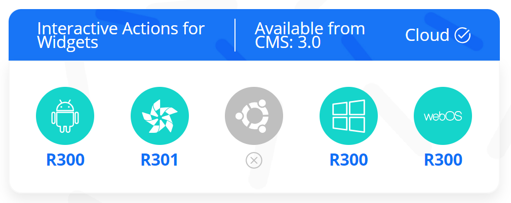

# Webpage

Display content from a webpage.


## Widget Overview:

- View a full webpage without any alterations.
- Scale and offset the target webpage to show a particular section of the webpage.
- Preload off screen ready for use.
- Trigger a web hook to navigate to an active action in the event of a webpage load error.

```
Note: This Widget requires a valid internet connection in order to function, webpages are not cached by the Player.
```

## Add Widget

From the Widget toolbar, select Webpage and click to add or drag and drop.
Once added, configuration options for this Widget will be shown in the properties panel.

- Provide a Name for this Widget for ease of identification within the CMS.
-
- Select to override the default duration if required.
-
- Provide the URL (including http://) of the webpage you wish to embed:
  

```
Available in Windows Players from v2 R253 select to render the webpage with a transparent background. Xibo will try its best to do this when enabled for pages which have a transparent background, however, it cannot be supported on some webpages.
```

```
After the page is rendered Xibo will scale to fit.
```

```
Available in Android Players from v2 R207 select to preload the Widget off screen so that it is ready to be shown.
```

- Use the drop-down menu to select how the webpage should be embedded using one of the following options:

## Open Natively

With this selected, the Player will open the webpage without any alterations and will open and render in the browser as if the URL had been visited on the device outside Xibo.

```
Please note: There is no preview available with this option!
```

From v3.1.0, there is an additional feature with a mechanism to trigger a web hook for an active action (navigate to Widget, navigate to Layout a Scheduled Command etc) to be shown in the event the webpage returns an error and fails to load.

Enter the Trigger Code of a configured Action to match against a supplied web hook trigger parameter.

Further information about configuring Interactive Actions can be found here

## Manual Position

This option will embed the webpage in an iframe where users can specify the dimensions required.
Use the Offset and Scale settings to force the page/sections of the page to fit within the dimensions to show just a section of the webpage:


## Best Fit

This option will embed the webpage in an iframe where users can specify the dimensions required:


```
NOTE: Manual Position and Best Fit options will not work with websites that set the X-Frame-Options header. If you are unable to see the webpage use the Open Natively option when using Windows / Linux or Android.
If X-Frame-Options are set then webOS and Tizen will not work in any mode!
```

If X-Frame-Options are not set then the website should show in any of the Players, using any of the above options.

Use this X-Frame-Options Header Checker Tool to see if the header has been set for the webpage you wish to target.

## Actions


Interactive Actions can be attached to this Widget.
