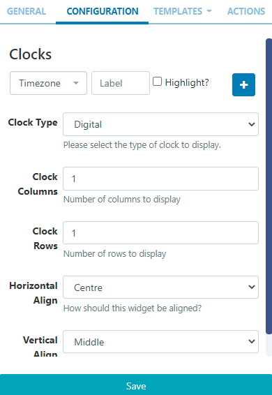
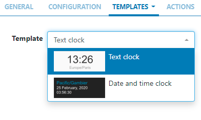
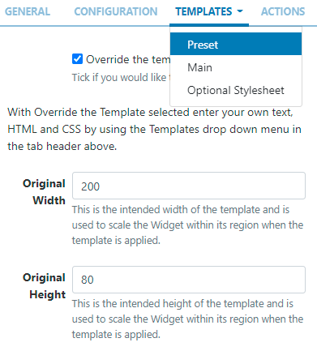
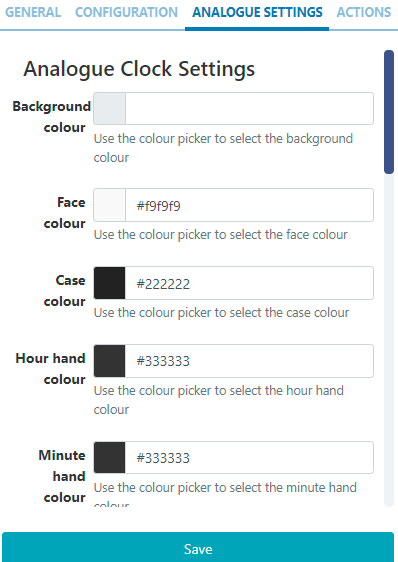
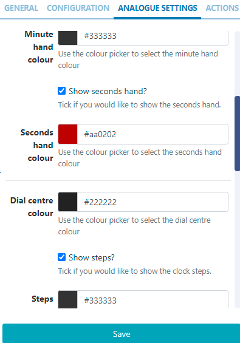

# World Clock

Display multiple clocks and timezones on Layouts.

```
If you are using a v3.0.x CMS, the World Clock Widget is only available on request by contacting our Help desk via My Account
```

## Add Widget

Locate World Clock from the Widget toolbar and click to Add or Grab to drag and drop to a Region.

On adding, configuration options are shown in the properties panel:

- Provide a Name for ease of identification.
- Choose to override the default duration if required.

## Configuration



- Use the drop down to select a Timezone.
-
- Enter a Label to be shown with the selected timezone.
-
- Optionally select to Highlight.
-
- Click on the + button to add multiple timezone clocks as required.
-
- Use the drop down to select from Digital or Analogue Clock Types.
-
- With multiple timezone clocks selected, set the number of Clock Columns and Clock Rows to display.

```
NOTE: From v3.1.0 users can set Horizontal and Vertical alignment options for this Widget!
```

- Save

Depending on the Clock Type selected, further options will be made available.

## Templates - Digital Clock Types

Use the drop down to select from the Preset Templates available to choose how the clocks will be displayed.


```
Click to Override the selected template if required.

Please see the section on Editing Preset Templates below for further information.

```

## Editing Preset Templates

Preset templates can be edited by clicking in the Override the template checkbox.

```
The template will be automatically scaled and should be designed for the intended output resolution. The following guidelines should be considered when editing templates:
- Templates must be designed at a fixed size
- All elements must use absolute sizing in px, including fonts, margins, widths, heights, etc
- If positioning is used, it must be from top,left
- Templates can use bootstrap
- The aspect ratio will be fixed by Sigma-DS and sized to fit the Region
- Templates are treated the same as a static image
```

Once override has been selected, click back on the Templates tab to select the template to edit:


Main - provide text/HTML in the box provided.

Optional Stylesheet - This is the CSS to apply to the template structure.

```
This optional template is intended for advanced users to ‘tweak’ the CMS generated output!
```

## Analogue Settings - Analogue Clock Types

With the Analogue Clock Type selected, an Additional Tab will be available to allow users to set colours for elements of the clock:


- Use the colour picker for each field to define.

- To to enable further settings and define colours:
  

- Save

## Actions

Interactive Actions can be attached to this World Clock Widget from the Actions tab in the properties panel. Please see the Interactive Actions page for more information.

## Date Format - PHP

Sigma-DS should accept any date format that is in a correct PHP date format, the following characters are recognised and can be used:
