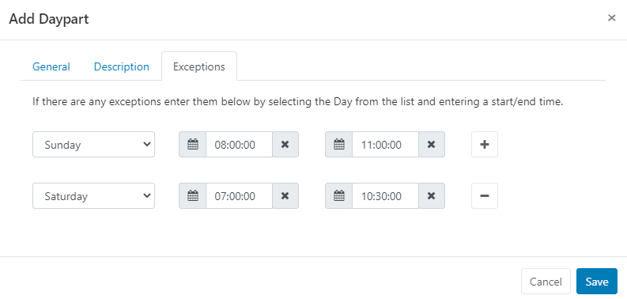

# Dayparting

```
In broadcast programming, dayparting is the practice of dividing
 the broadcast day into several parts, in which a different type of
  radio or television program apropos for that time period is aired. – Wikipedia
```

This supports the creation of multiple Dayparts, which can include day of the week exceptions. This means that a single day can be split into as many pre-defined parts as necessary.

```
A typical use case would be a hospitality User who has different
 content to display for Breakfast, Lunch and Dinner. Dayparting
  allows that User to create a Breakfast, Lunch and Dinner daypart,
   each of which starts and ends on a different day, to select for ease of Scheduling.
```

```
From CMS v2.2.0 Dayparts can also be created and defined to be selected to set a Displays Operating Hours.
```

## Create a Daypart

Dayparts are administered from the Dayparting page from the Menu and are created by clicking on the Add Daypart button. Complete the form fields to define the Daypart.


Once created the Daypart will show in the Dayparting drop-down list when Scheduling Events.

The below Daypart form shows an example Breakfast Daypart:

Saturday and Sunday have been configured as exceptions so that breakfast starts and ends at different times on those days.


When Scheduling, the Breakfast Daypart will appear in the drop-down list to select. Once selected, the from/to date time selectors will change to date only selectors and the time will be taken from the Daypart configuration - according to the day of the week the Event occurs on.

## Edit Dayparts

Dayparts can be Edited/Deleted and Shared using the Row Menu from the Dayparting Grid.

```
Updating the start/end times or exceptions for a Daypart will
 cause existing future events to be updated with the newly defined
  times. Existing recurring Schedules, set to recur beyond the current time,
   will have new Schedules created to reflect the updated information
```
