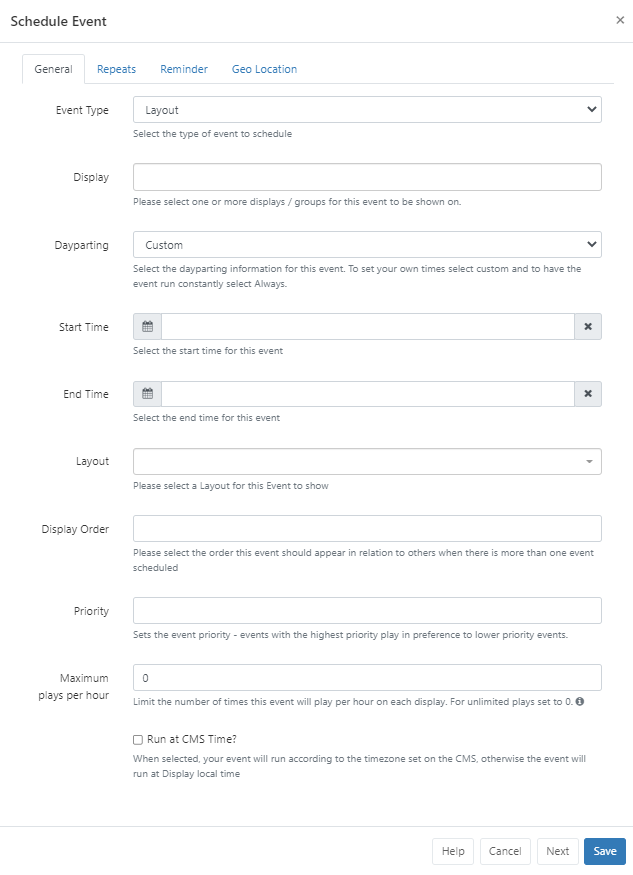
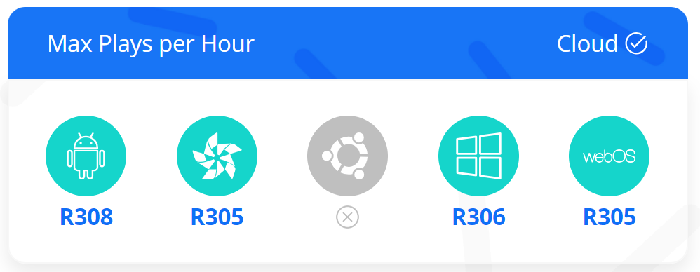
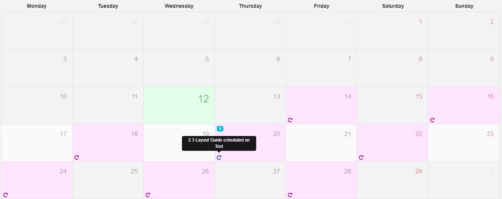
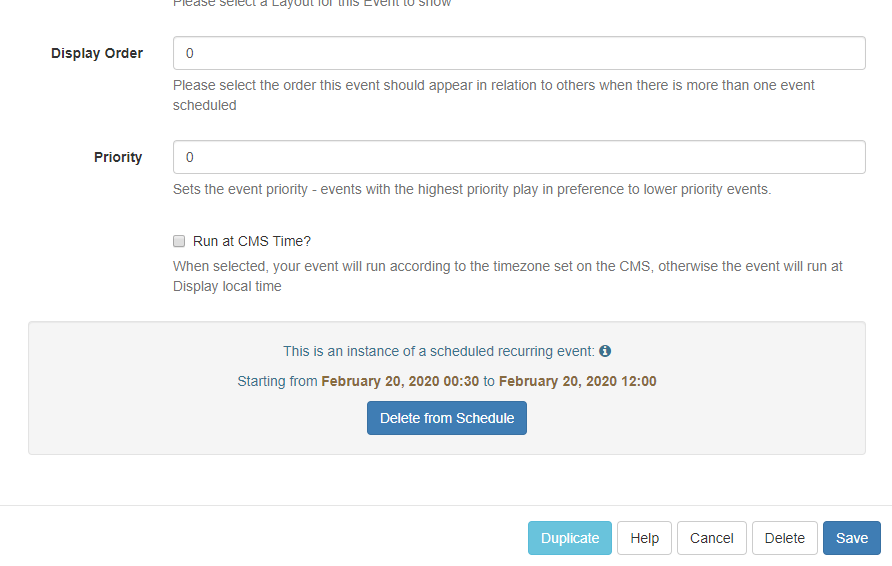
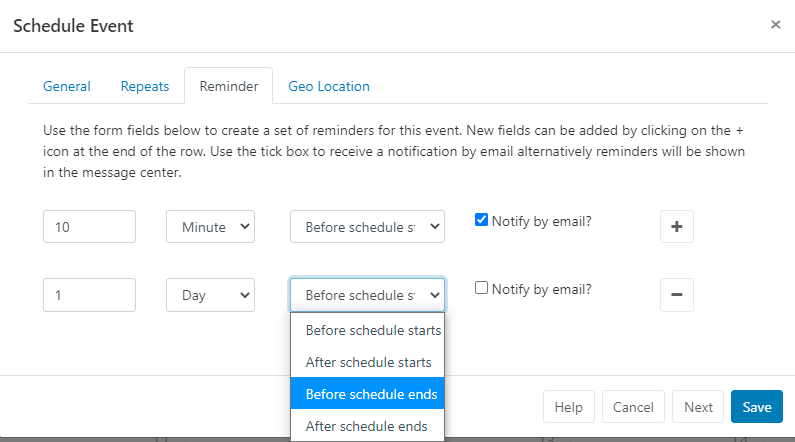
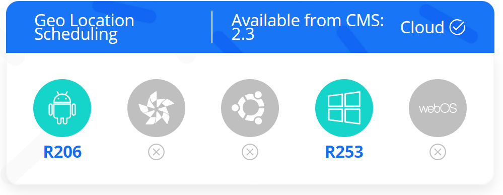

# Events

Events are administered from the Schedule section of the main menu.

Layouts, Campaigns, Overlay Layouts, Interrupt Layouts, Command and Action Event Types can be assigned to Displays/Display Groups to be shown at specific dates and times.

## Add Event

Click on the Add Event button on the calendar to schedule an Event.


## Event Type

Use the drop-down to select an Event Type:

- Layout - select Published Layouts.

- Campaign - select designed Campaigns.

- Overlay Layout - select a specifically designed Layout to schedule as an Overlay Layout.

- Interrupt Layout (available from v2.2.0) - select an Interrupt Layout to play for a specified Share of Voice to interrupt your usual schedule.

- Command - select from a predefined command.

- Actions (available from v3.1.0) - this Event makes the Player listen for a Trigger Code coming in on a webhook to trigger one of the following Action Types:

Navigate to Layout - enter the code identifier for the Layout that the Player should navigate to when triggered.

```
This code can be entered on adding a new Layout or by editing a Layout from the Layouts Grid row menu.
```

Command - select from the drop down menu.

```
Events, with the exception of Interrupt/Command and Action Events, can also be added using the Schedule Now function.
```

## Display

Click in the Display field to select one or more Displays/Display Groups to show the event content on.

## Dayparting

Custom/Always or User created Dayparts can be selected using the drop-down menu.

With Custom selected, use the date picker to select Start/End dates and times.

## Layout/Campaign

Use the drop-down menu to select the Layout or Campaign to schedule.

## Preview

Click on the Preview button to view the Layout or Campaign in another tab.

```
This is useful to use to ensure that the correct Layout or Campaign has been selected and to make checks, such as the total duration, without having to leave the schedule.
```

## Display Order

Determine the order in which the Layout/Campaign will play in rotation when scheduled at the same time as other Layouts/Campaigns. Ordering is by a simple numerical sort, lowest to highest numbers, therefore Layouts/Campaigns marked 1 will be played before Layouts/Campaigns marked 2.

The Display Order on Overlay Layouts determines the order in which the Layout Regions are applied to the overlay and compliments the Regions own layer settings.

```
To ensure ordering of Layouts we would recommend that these are ordered within a Campaign. The Display Order could then be used to determine the order in which entire Campaigns should playout. If no Display Order is specified for Campaigns or they have the same Display order the Campaigns will play according to the Play List order chosen for the Campaign, Interleaved or Block.
```

```
If you are using a CMS earlier than v3.3.0 Campaigns with the same display order will play interleaved.
```

## Priority

Set the Priority of the Event with the highest number stated playing in preference to lower numbers. This can be used to override all other non-priority Events on the schedule.

```
This functionality is useful for displaying temporary/important notices for overriding a schedule for a specific Event without having to make any changes to your existing schedule or cancelling Layouts/Campaigns that would be running at that time.
```

# Maximum Plays per Hour


Available from CMS v3.3.0 set a number in this field to limit the amount of times this Event is shown per hour on Displays. Leave as the default 0 for unlimited plays.

## Run at CMS Time

When selected, the Event will play at the time determined by the CMS rather than using the local display time.

```
Scenario CMS Time = GMT Display 1 = GMT Display 2 = GMT -4
An event scheduled for 11:00 with Run at CMS time deselected will run on display 1 at 11:00 and display 2 at 11:00. These two displays will not show the same content at the same time, because display 2 is 4 hours behind.

With Run at CMS time selected, display 1 will run at 11:00 as before but display 2 will run at 07:00.

```

Please note The Schedule Now functionality will always create events with this option selected.

## Repeats

An Event can be repeated at defined intervals (hourly, daily, weekly, monthly or yearly) until a specified time. Use the Repeats tab to create recurring events. Select the type of repeat from the drop-down and complete the form fields as required. Use Repeat every to further specify the frequency of the repeat.

```
E.g. With a Weekly Repeat you could specify to repeat each Wednesday and Friday every other week by including a 2 in the ‘Repeat every’ form field.

```

```
Available from version 2.0 and later, Monthly Repeats can be determined by the Event date or by the day in the month the event falls on.
For example: an event which is scheduled on 06/03/2019 can be set to repeat on the 6th day of every month or the 1st Wednesday of each month (as 06/03/2019 falls on a Wednesday).

```

- To completely remove all instances of a Recurring Event, click on the Delete button at the bottom of the form.
  From v2.3, an individual recurrence can be deleted from the Schedule.
  

- Click on the Recurring event you wish to remove from the Schedule, to open the Edit Event form.
  
- Click on the Delete from Schedule button to remove this singular event from the schedule and remove it from all Displays.

```
Care should be taken if amendments are made to the Schedule after deleting individual instances of a recurring schedule. Previously deleted instances could be recreated with any edits made to the existing Schedule.
```

## Reminders

From v2.2.0 create a set of reminders to be sent to the Notification Drawer as well as notified by email for selected scheduled Events.

```
Please ensure that your Administrator has entered a Sending Email address on the CMS Settings page, Network tab prior to set up of Reminders.
```


Use the form fields to define a reminder, use the + icon to add additional fields. Tick the box if you wish to be notified email, this will be sent to the email address as set for your User Profile.

## Geo Location


Tick the checkbox to make this Event location aware. Further details can be found on the Geo Scheduling page.

## Edit / Delete

Click on any Event/Icon in the calendar to edit form fields or to remove completely from the schedule by clicking delete and confirming.

### Duplicate

Located at the bottom of the Edit form, the Duplicate button allows for event details to be duplicated and configured for a new event. Once clicked a pop up will appear to confirm that a new form has been loaded so that amendments can be made.

```
The new loaded form will not have a Duplicate button!
```
