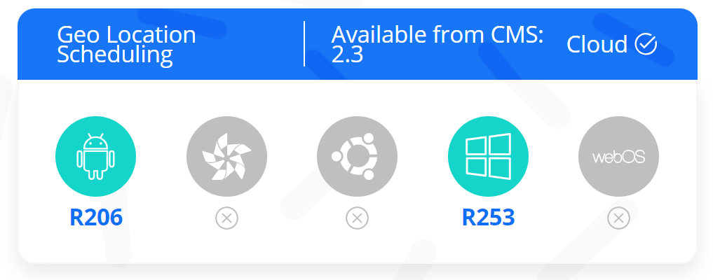
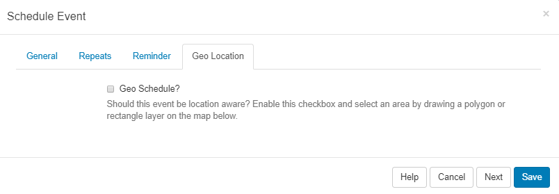
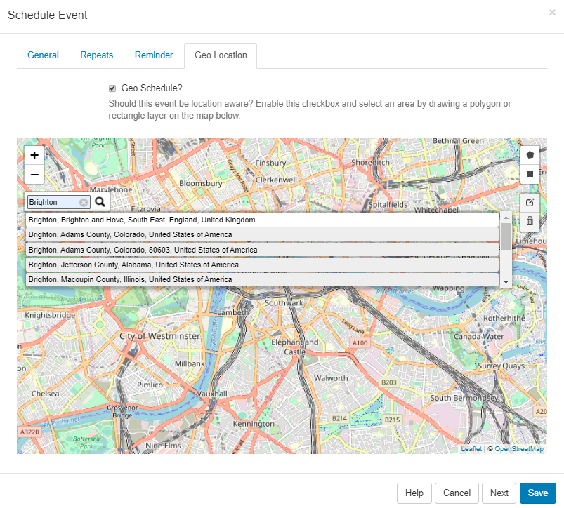
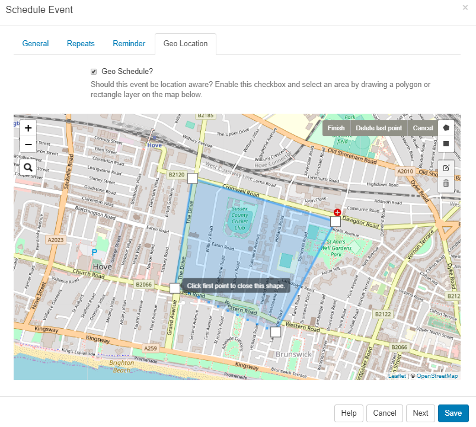
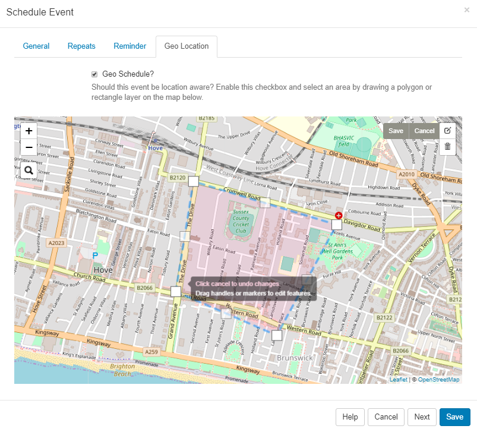
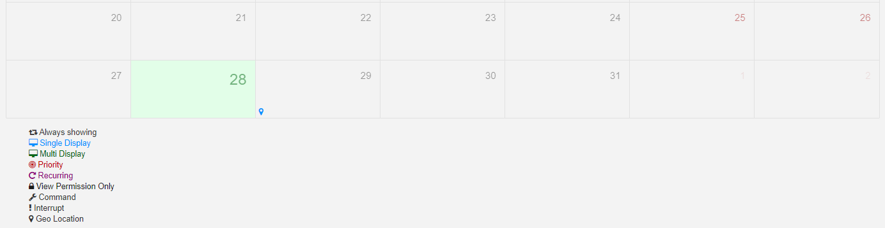

# Geo Scheduling


Click on the Geo Location tab on the Schedule Event form.


Tick in the Geo Schedule box to enable and define the location.

```
On opening, the map will default to what is entered for DEFAULT_LAT and DEFAULT_LONG in CMS Settings, under the Displays Tab.
```

Use the buttons in the top left of the map to Zoom in and out. Click on the search icon to enter details for a particular area.


Define an area by drawing a Polygon or Rectangle layer on the map.


Once an area has been defined, click on the edit icon to to drag the markers to make adjustments to the existing Layer. Click on the grey Save button located here to ensure that edits are saved.


To remove the area, use the bin icon and click into the area to delete, click the grey Save button to save the removal of the layer.

Once scheduled, the scheduler will identify this event as being Geo Location aware by showing the map marker icon.

