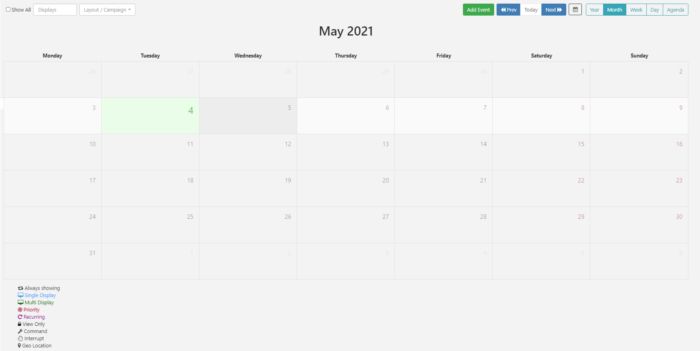

# Scheduling

It has a sophisticated scheduling system which allows for the simple creation of complex schedules for Events across Displays/Display Groups.

## Events

Events are administered from the Schedule section of the menu and managed from the calendar interface.


The CMS supports scheduling for the following Event types:

## 1. Layout Event

Select Published Layouts to schedule to Displays.

## 2. Campaign

Select Campaigns to schedule to Displays.

## 3. Overlay Layout Event

Specially created Overlay Layouts are scheduled at the same time as existing Layouts to create an overlay of content to be displayed.

## 4. Interrupt Layout Event


A Layout that is scheduled as an Interrupt Layout will interrupt your usual schedule to fit around other scheduled Layouts to play for the specified Share of Voice percentage set.

## 5. Command Event

A Scheduled Command can be executed by the Player at a specific point in time and therefore this type of event does not need a toDt.

Available Commands can be selected using the Command drop-down menu on the Schedule Event form.

```
Display Order and Priority are irrelevant when it comes to executing
 the Command, but may be set in the CMS for organisational purposes.
```


Actions allows listening for webhooks independently to Layouts. Users can schedule Action Events to Navigate to a Layout or run a Command.

## Schedule Events

Events are scheduled into Dayparts. Select from the two available options when configuring an Event:

### - Custom

Create your own To/From dates and times.

### - Always

Select to have the event run constantly.

```
Create your own defined Dayparts for ease of scheduling.
 Once created these will show in the Dayparting drop down menu for selection!
```

## Priority

Use Event Priority to determine whether the event should be included in the schedule for the Player or not. A ‘Priority Event’ is determined by a number, with 0 considered the lowest Priority.

```
If a Player has a schedule containing Events which are all Priority 0,
 then all of the Events will be shown in rotation together.
If 1 of the Events has a Priority of 1, then this will be the only Event shown.

If there are some Events with Priority 0, some with Priority 1 and some with Priority 2 only the Priority 2 Events will be shown, in a rotation for that Scheduled period (as the highest Priority)

A good example to use Priority would be in a way to alter the Schedule at a specific time, for example, a normal rotation during the day with a Priority Event at lunchtime which shows specific ‘lunch’ information (i.e. Lunchtime specials on a cafe menu).
```
