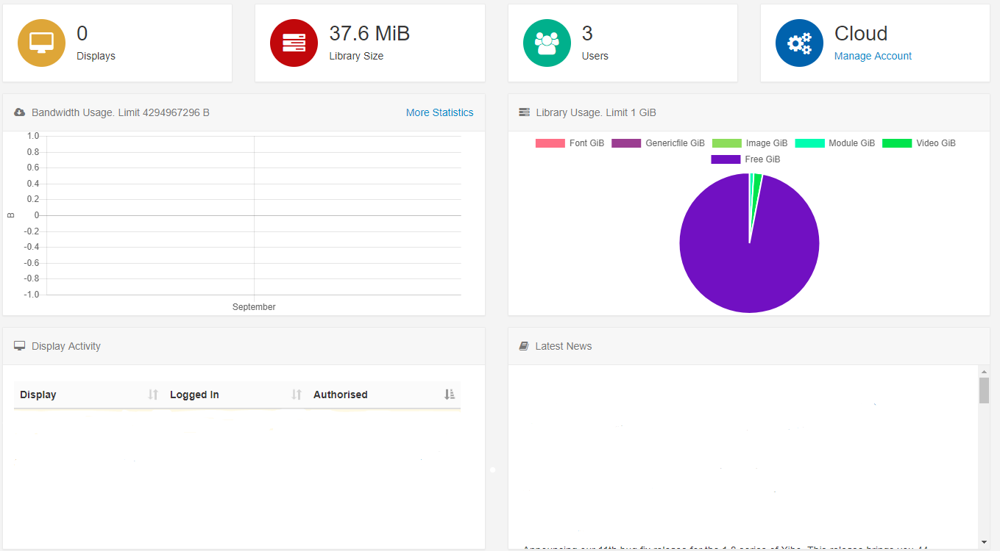
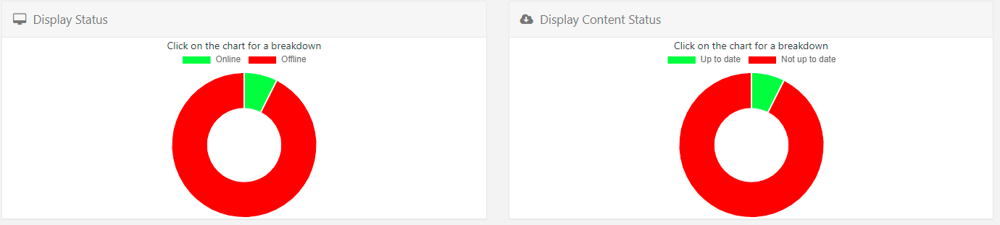
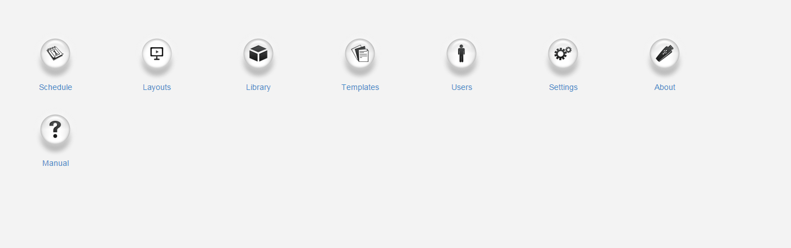
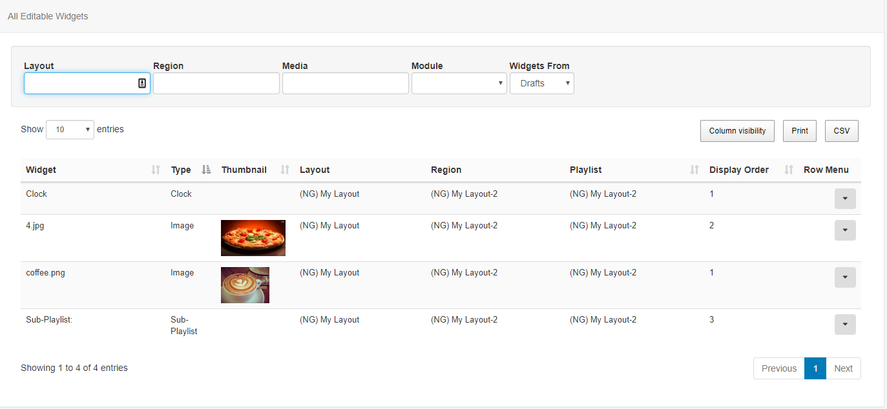
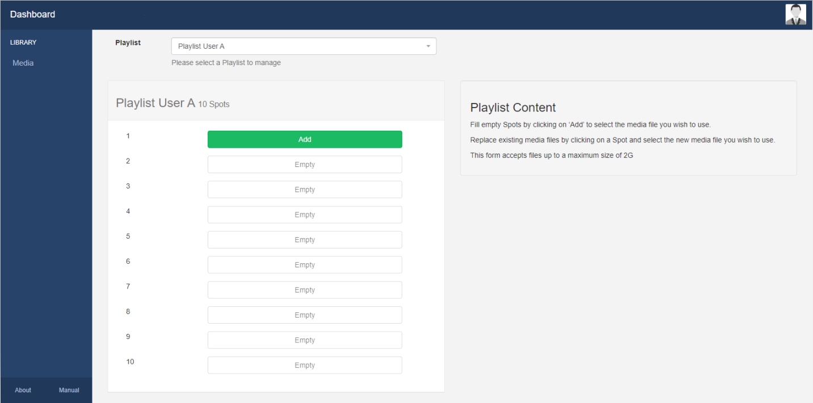

# CMS Dashboards

Dashboards can be assigned as a Homepage when adding or editing Users which will allow access to permitted areas of the CMS for that User. There are four Dashboard views for the CMS that can be assigned, which will be the first screen Users will be taken to after login.

## Status Dashboard

The CMS Status Dashboard is the default Dashboard for Super Admin Users and is intended as a high-level view of the system for Administrators. It gives an overview to how many Display have been connected, how many Users have been added and provides information relating to Library and Bandwidth usage as well as Display Activity for connected Displays.

Scroll down to see further charts which show Display Status and Display Content Status

The above screenshot shows the Online Display Groups Status with further Display information shown in the grid below.

Use the Displays Page link to be redirected straight to the Displays page!

## Icon Dashboard

The CMS Icon Dashboard is a default Dashboard used for all newly assigned Users and is intended as a Launcher into other areas of the CMS. The icons within the Dashboard are shown/hidden according to the Feature access for the User.

## Media Manager Dashboard

The CMS Media Manager Dashboard can be selected for Users who should only edit the Media they have been given access to. The Media Manager Dashboard gives a restricted access view of the CMS presented in a grid style interface which lists each item the User has Share options enabled for. Users can use the 'Widgets From' dropdown menu to select Widgets from Drafts or Playlists and use the available filters.

## Playlist Dashboard

The Playlist Dashboard can be assigned to Users who belong to the Playlist Dashboard User User Group so that they only have access to upload/replace media in Playlists they have enabled Share options for.

The Playlist Dashboard gives a very restricted view of the CMS with a User only able to select specific Playlists to manage using the drop-down menu.

Spots are configured using the Sub-Playlist Widget which determines how many media files a User can upload.

Please note: Administrators need to ensure that the Sub-Playlist Widget has been added to a Layout and configured to show the User's Playlist with defined Spots before the User can add/replace Media using the Playlist Dashboard.
