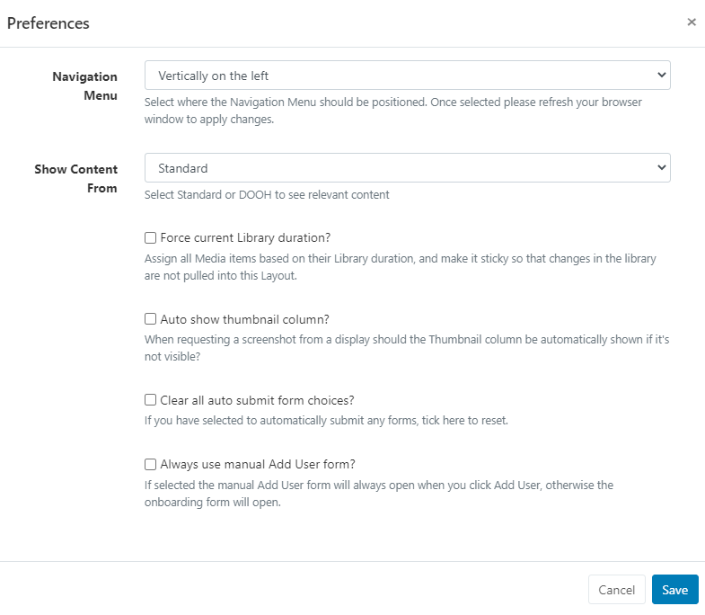

# User Profile

The User Profile is used to set Preferences, Edit Profile and manage options for the logged in User.

Located in the top right of the CMS, click on the icon to open.

```
The CMS time and timezone that has been set in the Regional settings is displayed here!
```


## Preferences



Use the drop down menu to select how you would like the Navigation Menu to be positioned for the CMS.

```
Once selected and saved, ensure you refresh your browser to apply the change.
```

## Edit Profile


The Edit User Profile form allows a logged in User to:

Change Passwords Update a User Email address

Enable Two Factor Authentication Reshow Welcome Take a short tour of the CMS to assist with navigation and functionality.

## Logout

Click to securely logout of the CMS Instance after each User session. All new Users are strongly advised to navigate to the User Profile menu to change their password the first time they log into the CMS.
